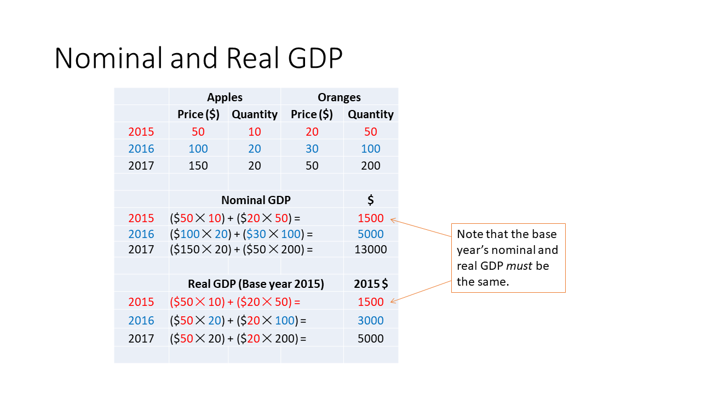
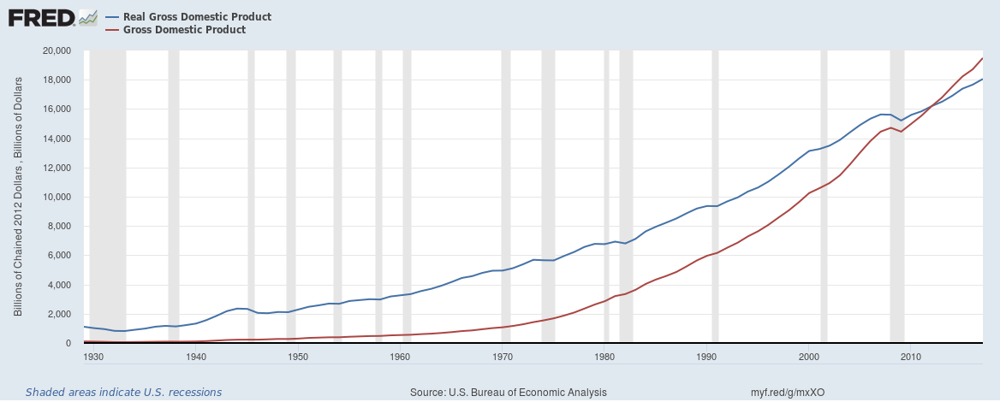
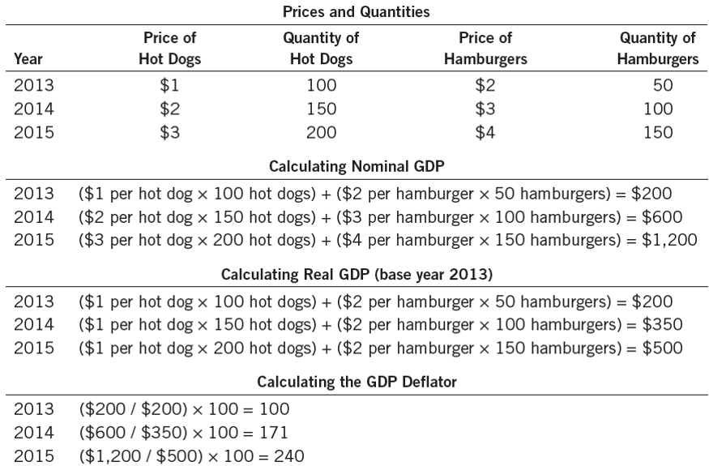
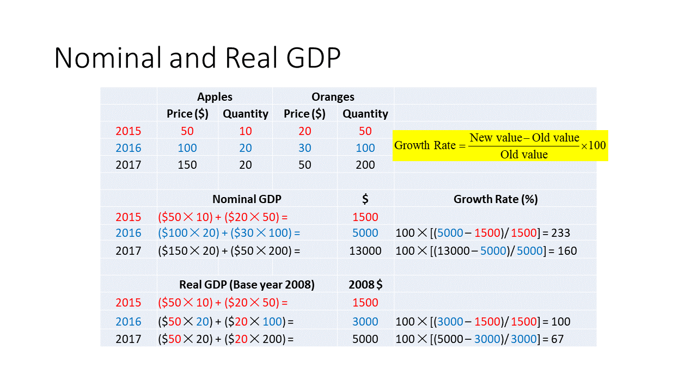
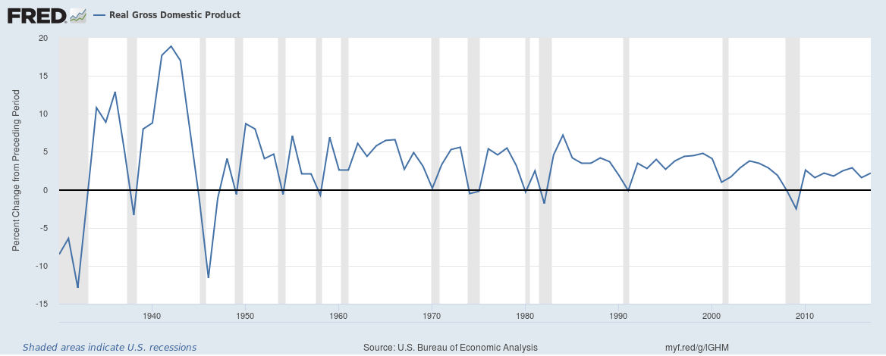

# Measuring a Nation’s Income {#natincome}

## Introduction

### Economics, Microeconomics, and Macroeconomics

__Microeconomics__ is the study of how individual households and firms make decisions and how they interact with one another in markets.
__Macroeconomics__ is the study of the economy as a whole.
Its goal is to explain the economic changes that affect many households, firms, and markets at once.

Macroeconomics answers questions such as these:

* Why is average income high in some countries and low in others? 
* Why do prices rise rapidly in some time periods while they are more stable in others? 
* Why do production and employment expand in some years and contract in others? 

### The Role of Data

To see whether an economy faces a problem, you first need data.

* Data help policy makers see what problems, if any, need to be addressed
* Data help macroeconomists identify the theories that make correct predictions and the theories that make incorrect predictions
* Data often reveal interesting puzzles that macroeconomic theories need to solve

## Gross Domestic Product

### Total Income

Recall that we need to measure the health of an economy.
When judging whether an economy is doing well or poorly, it is natural to look at the total income that the people in the economy are earning.

We can temporarily boost our standard of living by borrowing from others. 
But we can’t keep borrowing forever.
This is why a nation’s standard of living depends heavily on its own total income.

### Income = Expenditure

We could measure either total income or total expenditure.
We would get the same number either way.
For an economy as a whole, income must equal expenditure because:

* Every transaction has a buyer and a seller.
* Every dollar of spending by some buyer is a dollar of income for some seller. 

But what about _saving_?
Q: People typically save part of what they earn. How then is income equal to expenditure for the economy as a whole?
A: What people save tends to get loaned to businesses who then spend the money they borrowed. So, for the economy as a whole, income must still equal expenditure.

But what about _international trade_? We buy foreign-made goods and foreigners buy goods made by us.

Q: In that case, how can our total income be equal to our total expenditure?

A: This is correct. It is better to say that total income of domestic residents equals the total expenditure on domestically produced goods.

### Gross Domestic Product: Definition

Gross Domestic Product (GDP) is one measure of a country’s total income.
There are other measures of total income, but GDP is the most popular measure.

__GDP is the total market value of all final goods and services produced within a country in a given period of time.__
For example, the GDP of the United States in 2017 was $19,390.6 billion, according to the U.S. Department of Commerce. 
Given a mid-year population of 325,983,000 (est.) the per capita (or, per human) GDP was $59,484.

__GDP is also the total expenditure on all final goods and services produced within a country in a given period of time.__
__GDP is also the total income of all domestically located resources.__

#### GDP is the Market Value … 

In GDP, all output is valued at market prices.
The market value of all sandwiches produced is both the total expenditure of the buyers of those sandwiches and the total income of the makers of those sandwiches.
As our goal is to measure total income, it therefore makes sense to measure the market values of the various produced goods and add them up.

#### … Of All Final Goods …

__Final goods are those goods sold to their final users.__

Here's an example of a final good: A pencil is a final good because, once produced, it is ready for use by its final users. 

The wood, the graphite, and other materials that disappeared in the pencil are _not_ final goods.
Their market value is already counted when the market value of the pencil is counted.
So, counting them in GDP would count them twice.

GDP records only the value of final goods, not intermediate goods.
__Intermediate goods are those goods that disappear inside other goods that are produced for sale. Final goods are goods that are not intermediate goods. These are goods sold to their final users.__ 
GDP is defined so that the value of intermediate goods is counted only once, not twice or thrice.

Intermediate goods are goods that are sold by their producers to producers of other goods.
Examples: milk sold by a dairy to an ice-cream company, grapes sold by a vineyard to a winemaker, printer paper sold to Kinko’s.
Final goods are goods that are sold to the final users of those goods.
Examples: milk you buy at the supermarket, table grapes you buy at the farmer’s market, printer paper you buy for your computer printer.
All goods made this year but not sold by year’s end are regarded as final goods (inventories).

Suppose a dairy farmer sells milk worth $50,000 to an ice-cream company. 
The farmer does not buy anything from any other firm.
The total income of the dairy farmer and her employees is, therefore, $50,000.
The ice-cream company uses the milk to produce ice-cream which it sells for $75,000. 
The ice-cream company does not buy anything from any firm other than the dairy.
Therefore, the total income of the owners and employees of the ice-cream firm is $25,000.
Therefore, the total income of this country is $75,000.
This is accurately measured by the value of the ice-cream (the final good) alone.
Had we also counted milk, the intermediate good, we would have calculated total income to be $125,000, which would have been an exaggeration.

#### … and Services …

GDP includes both tangible goods (food, clothing, cars) and intangible services (haircuts, housecleaning, doctor visits, legal consultations). 

Trade in assets does not affect GDP. 
Such trade does not require new productive activity, it is merely the transfer of ownership of an asset from one person to another. Neither participant is paying the other for a good or service. They are simply exchanging property.

#### … Produced Within a Country …

GDP measures the value of all production within the geographic boundaries of a country.
The _citizenship_ of the owners of the resources used in production is _not_ the key issue.
Production by foreigners living in a country is counted in that country’s GDP.
Production by a country’s citizens working in _other_ countries is _not_ counted.

#### … In a given period of time

GDP measures the value of production that takes place within a specific interval of time, usually a year or a quarter (three months). 
GDP measures the value of goods and services _currently_ produced. GDP ignores current transactions that involve goods that were produced in the past.
Current transactions involving used cars or buildings that were constructed in the past are not counted in current GDP.

### What’s not counted in GDP?
GDP includes the market value of all items produced in the economy and sold legally in markets.
It excludes items produced and sold illicitly, such as illegal drugs.
GDP excludes most items that are produced and consumed at home and that never enter the marketplace.

For more on Gross Domestic Product, check out [this video](https://youtu.be/mjJmo5mN5yA).

## Nominal and Real GDP

How can we measure a nation’s productive activity in different years so that the numbers can be compared across time?

The GDP we have seen so far is more precisely called __Nominal GDP__. One can't use data on nominal GDP for 1915 and 2015 to draw a meaningful conclusion about productive activity in those two years.

GDP comes in two flavors:

* Nominal GDP (also called GDP at current prices), and
* Real GDP (also called GDP at constant prices)

So, when you see or hear a discussion of GDP, be sure to ask, “Nominal or real?”

### Gross Domestic Product, Nominal

Nominal GDP is the total market value of all final goods and services produced within a country in a given period of time.
The market value is calculated using _current prices_, the prices that prevailed when the production took place.

For example, the nominal GDP of the United States in 2017 was $19,390.6 billion, according to the U.S. Department of Commerce.
Given a mid-year population of 325,983,000 (est.) the per capita (or, per human) nominal GDP was $59,484.

### Gross Domestic Product, Real

Real GDP is the total market value of all final goods and services produced within a country in a given period of time. This is the same as for nominal GDP, but there's a twist.
The market value is now calculated using _constant prices_, the prices that prevailed in a benchmark year called the base year.

For example, the real GDP of the United States in 2017 was $17,096.2 billion in 2009 dollars, according to the U.S. Department of Commerce.
Given a mid-year population of 325,983,000 (est.) the per capita (or, per human) real GDP was $52,445 in 2009 dollars.

To further explore the difference between the calculation of Nominal GDP and Real GDP, take a look at Figure \@ref(fig:gdp-math-1). It presents a numerical example showing the calculation of nominal and real GDP, this time with hypothetical data:

```{r gdp-math-1, fig.cap='Calculation of Nominal and Real GDP with hypothetical data', out.width='100%', fig.asp=.75, fig.align='center', echo=FALSE}

```

For more on Nominal vs. Real GDP, see [this video](https://youtu.be/rGqhTQyY6g4).

And here's a chart showing Nominal and Real GDP for the US:

```{r gdp-fig, fig.cap='Real GDP in 2012 Dollars and Nominal GDP', out.width='100%', fig.asp=.75, fig.align='center', echo=FALSE}

```

<!--And here it is again, without the use of an R chunk:

The following, however, with the weird URL, did not work

Why not? -->

The data source for Figure \@ref(fig:gdp-fig) is [here](https://fred.stlouisfed.org/graph/?id=GDPCA,GDPA,).

### The GDP Deflator {#gdp-deflator}

__The GDP deflator is a measure of the overall level of the prices of the final goods and services produced within a country during a given period of time.__
The GDP Deflator tells us how much of the rise in nominal GDP over a period of time is attributable to a rise in prices (rather than to a rise in production). 
The GDP Deflator is calculated as follows: 
\begin{equation} 
  \textrm{GDP Deflator for 2018 with Base Year 2009}\equiv\frac{\textrm{Nominal GDP in 2018}}{\textrm{ Real GDP in 2018 with Base Year 2009}}\times 100
  (\#eq:gdp-deflator)
\end{equation}


Example: In 2013, US Nominal GDP was $16,803.0 billion.
US Real GDP was $15,767.1 billion (in chained 2009 dollars). Therefore, 
US GDP Deflator = (16,803.0/15,767.1) × 100 = 106.57.
This means that the final goods and services produced in 2013 had a market value in 2013 prices that was 106.57 percent of their market value in 2009 prices.
This means that, roughly, final goods and services were on average 6.57% pricier in 2013 than in 2009.

Figure \@ref(fig:gdp-math) presents another numerical example showing the calculation of nominal and real GDP, again with hypothetical data, and emphasizing the calculation of the GDP Deflator:

```{r gdp-math, fig.cap='Calculation of Nominal GDP, Real GDP, and the GDP Deflator with hypothetical data', out.width='100%', fig.asp=.75, fig.align='center', echo=FALSE}

```

By the way, why do we call the GDP Deflator a _deflator_?
Nominal GDP changes from one year to the next partly because of inflation.
Real GDP, on the other hand, changes because of changes in production alone.
The GDP Deflator can convert Nominal GDP to Real GDP by deflating the effect of inflation in Nominal GDP. Hence, the name deflator.

#### Converting Nominal GDP to Real GDP using the GDP Deflator

Note that Equation \@ref(eq:gdp-deflator) above can easily be re-written as follows:
\begin{equation} 
  \textrm{Real GDP in 2018 with Base Year 2009}\equiv\frac{\textrm{Nominal GDP in 2018}}{\textrm{GDP Deflator for 2018 with Base Year 2009}}\times 100
  (\#eq:nom2real)
\end{equation}

Therefore, if you know the numbers for Nominal GDP and the GDP Deflator, you can calculate  Real GDP.

### The Growth Rate of GDP

Consider the value of a variable at two dates. The growth rate of the variable over the intervening period is the increase in the value of the variable from the earlier date to the later date divided by the value of the variable at the earlier date. Multiply by 100 to express the growth rate as a percentage, if you wish.

In the case of the annual growth rate of GDP, see Equation \@ref(eq:gdp-growth):
\begin{equation}
  \textrm{GDP Growth Rate in 2018}\equiv\frac{\textrm{GDP in 2018} - \textrm{GDP in 2017}}{\textrm{GDP in 2017}}\times100
  (\#eq:gdp-growth)
\end{equation}

Note that the growth rate could be _negative_, if GDP decreases over time.

Figure \@ref(fig:gdp-math-2) continues with the hypothetical data in Figure \@ref(fig:gdp-math-1) and calculates the growth rate of GDP:

```{r gdp-math-2, fig.cap='Calculation of Nominal GDP, Real GDP, and their growth rates with hypothetical data', out.width='100%', fig.asp=.75, fig.align='center', echo=FALSE}

```

Returning to actual data, here's a chart showing the growth rates of real GDP for the United States:

```{r gdp-growth-fig, fig.cap='Annual Growth Rate of Real GDP in 2012 Dollars', out.width='100%', fig.asp=.75, fig.align='center', echo=FALSE}

```

The data source for Figure \@ref(fig:gdp-growth-fig) is [here](https://fred.stlouisfed.org/series/A191RL1A225NBEA).

## GDP and the Components of GDP

We need to pay attention not only to the total expenditure on all final goods and services made in a country (that is, to GDP, nominal or real), we also need to watch where the expenditure is coming from. That way, when there’s a recession, we’ll know which sector needs the most attention.

Expenditure on “Made in USA” final goods and services can come from only these four sources:

* Households (Consumption expenditure)
* Businesses (Investment expenditure)
* Government entities (Government purchases)
* Foreigners (Exports)

So, one might think that:
$$\textrm{GDP} = \textrm{Consumption Spending} + \textrm{Investment Spending} + \textrm{Government Spending} + \textrm{Exports}.$$
But that would be incorrect! 

The correct equation linking total expenditure (or, GDP) to its component expenditures is instead the following:
$$\textrm{GDP} = \textrm{Consumption Spending} + \textrm{Investment Spending} + \textrm{Government Spending} + \textrm{Exports}-\textrm{Imports}.$$

Q: Why do we subtract imports?

A: GDP is the market value of all final “Made in USA” goods. But consumption, investment, and government purchases all include spending on foreign goods. Therefore, to make the two sides of the equation the same, we must take out all the imports.

Exports – Imports is called _Net Exports_.

### The Four Components Of GDP {#gdp-components}

* Consumption ($C$): The spending by households on goods and services, with the exception of purchases of new housing.
* Investment ($I$): The spending on capital equipment, inventories, and structures, including new housing.
* Government Purchases ($G$): The spending on goods and services by local, state, and federal governments. Does not include transfer payments because they are not made in exchange for currently produced goods or services.
* Net Exports ($NX$): Exports minus imports.

Throughout this book, real GDP will be denoted by the symbol $Y$. Then, the last equation above becomes:
\begin{equation} 
  Y=C+I+G+NX.
  (\#eq:natincidentity)
\end{equation}
This equation, which will be used again and again throughout this book is called the __national income identity__.^[An identity is an equation that is _always_ true, simply by virtue of the way the variables in the equation are defined.]


For more on the link between GDP and its components, see [this video](https://youtu.be/ChnRwedmO64). 


### US data on GDP and its Components

Two excellent sources of data on GDP and its components for the US are:

* [Bureau of Economic Analysis, U.S. Department of Commerce](http://bea.gov)
* [Federal Reserve Bank of St. Louis](http://research.stlouisfed.org/fred2/categories/18)

Check out these links:

* [Consumption, as a share of GDP](https://fred.stlouisfed.org/series/DPCERE1Q156NBEA)
* [Investment, as a share of GDP](https://fred.stlouisfed.org/series/A006RE1Q156NBEA)
* [Government Purchases, as a share of GDP](https://fred.stlouisfed.org/series/A822RE1A156NBEA)
* [Net Exports, as a share of GDP](https://fred.stlouisfed.org/series/A019RE1A156NBEA)
    * [Exports](https://fred.stlouisfed.org/series/B020RE1A156NBEA)
    * [Imports](https://fred.stlouisfed.org/series/B021RE1A156NBEA)


## International GDP comparisons

How can we measure national productive activity so that the numbers can be meaningfully compared across nations?

When the GDP numbers for various countries are compared, the same currency units must be used.
There are two ways of converting from national currencies to a common currency, such as the US dollar:

* Use market exchange rates
* Use a common set of prices (Purchasing Power Parity)

### Market Exchange Rate Method

* Step 1: Look up Mexico’s GDP in Mexico’s currency, the peso.
* Step 2: Look up how many US dollars one Mexican peso is worth.
* Step 3: Multiply the numbers in Steps 1 and 2. 

This gives you Mexico’s GDP in US dollars. When the GDPs of two countries are both expressed in US dollars, they can be compared head to head.

### Purchasing Power Parity Method

* Step 1: Find out the quantities of all the final goods that were produced in Mexico during, say, 2016
* Step 2: Find out the prices of those goods in the United States--not Mexico--in 2016. 
These prices are in US dollars.
* Step 3: Calculate Mexico’s GDP in US dollars, by
    * Step 3a: multiplying the quantities in Step 1 by the corresponding prices in Step 2 and 
    * Step 3b: then adding the results obtained in Step 3a

### Let’s Compare the Two Methods

* [GDP per capita (current US$)](https://data.worldbank.org/indicator/NY.GDP.PCAP.CD)
* [GDP per capita, PPP (current international $)](https://data.worldbank.org/indicator/NY.GDP.PCAP.PP.CD)
* [GDP per capita (constant 2010 US $)](https://data.worldbank.org/indicator/NY.GDP.PCAP.KD)
* [GDP per capita, PPP (constant 2011 international $)](https://data.worldbank.org/indicator/NY.GDP.PCAP.PP.KD)

Let’s Compare GDP!
Let’s Compare GDP per capita!

For more on the basic facts of economic prosperity across countris, see [this video]( https://youtu.be/PzAr_mL0Qd8)

## Is GDP a good measure of economic well-being? {#gdp-and-wellbeing}

No, but it is the best one-number measure we have.

There’s a lot about well-being that’s missing in GDP: economic inequality, work done in home, volunteer work, illegal work, leisure, environment, disasters, …

### Income Inequality

Trends in US Poverty Rate

### Leisure Reduces GDP

### GDP Doesn’t Count Illegal Work

### GDP Doesn’t Count Work at Home

### GDP Doesn’t Count Volunteer Work

### GDP Ignores Environmental Damage

### GDP Ignores Consumer Surplus

Free digital technology, Free Apps, Google, Google maps, Wikipedia, OpenOffice, YouTube, Freely available education (Khan Academy, Coursera) ... None of this adds to GDP.
Users would be willing to pay but don’t. They get Consumer Surplus.

### Disasters May Raise GDP

### There's a lot more to life than production

Here's [Robert F. Kennedy](https://en.wikipedia.org/wiki/Robert_F._Kennedy) reminding us of all that is missing in GDP:

> (Gross Domestic Product) does not allow for the health of our children, the quality of their education, or the joy of their play. It does not include the beauty of our poetry or the strength of our marriages, the intelligence of our public debate or the integrity of our public officials. It measures neither our courage, nor our wisdom, nor our devotion to our country. It measures everything, in short, except that which makes life worthwhile, and it can tell us everything about America except why we are proud that we are Americans.

### So, in the final analysis ...

GDP is the best single measure of the economic well-being of a society. 
GDP per person tells us the income and expenditure of the average person in the economy.

For more on the link between Real GDP Per Capita and the Standard of Living, see [this video](https://youtu.be/Z0qHA93oOSc).

<!--Historical note: The collection of data for national income accounting in the US was pioneered by Simon Kuznets:


```{r kuznets, fig.cap='Simon Kuznets',fig.align='center', echo=FALSE}
knitr::include_graphics("https://upload.wikimedia.org/wikipedia/commons/6/6c/Simon_Kuznets_1971b.jpg")
```
-->
