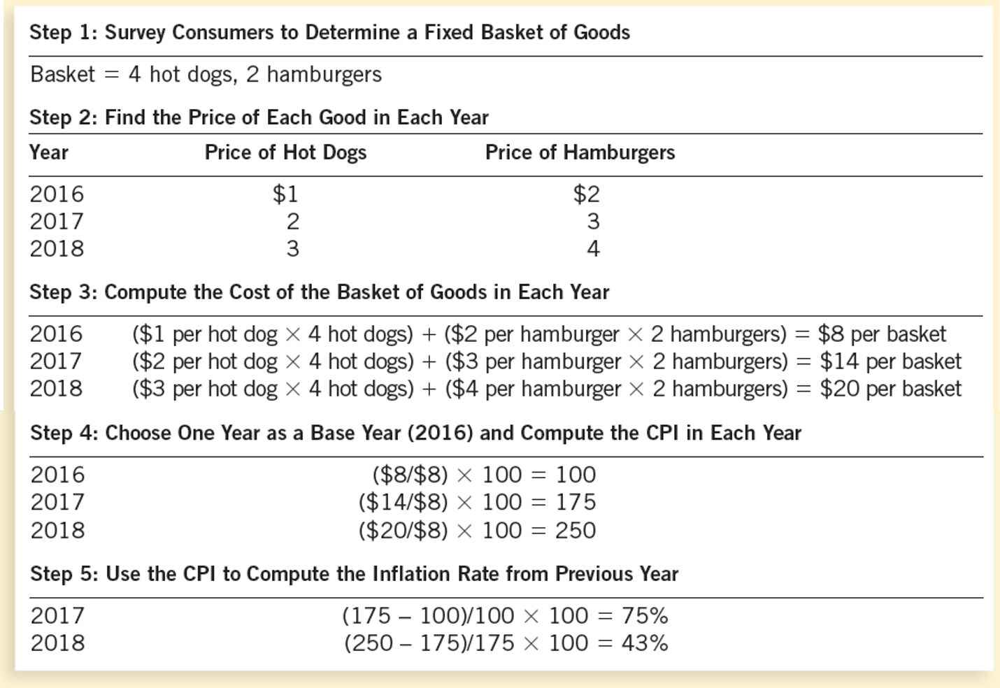
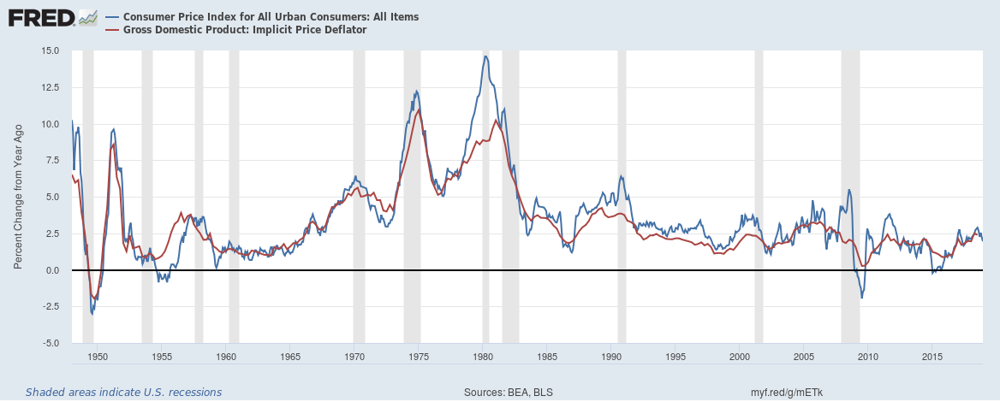
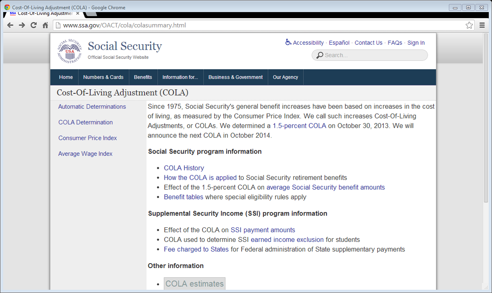
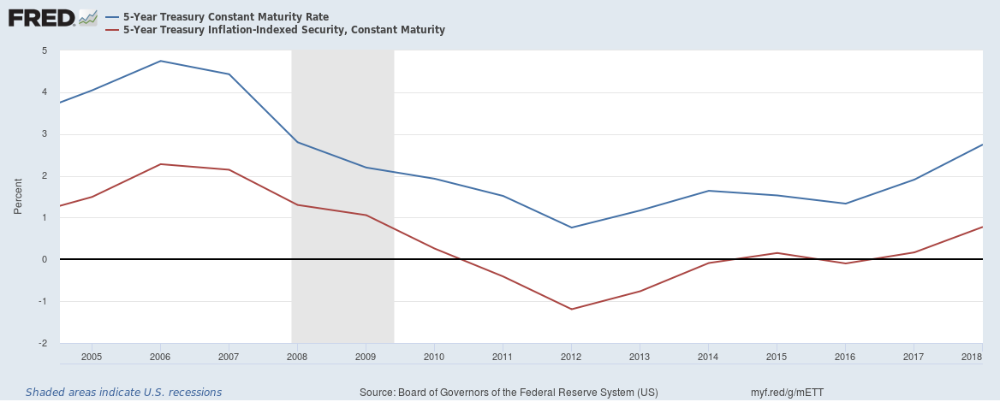

# Measuring the Cost of Living {#costofliving}

* What’s the cost of living the way we actually live? That is, what’s the cost of buying the things we buy?
* Why do we need to know the cost of living?

## The Consumer Price Index

The Consumer Price Index (CPI) is a measure of the overall cost of the goods and services bought by a typical consumer. So, it is a measure of the cost of living.

Here's CPI data for the United States: https://www.bls.gov/news.release/cpi.toc.htm. The [Bureau of Labor Statistics](https://www.bls.gov/) reports the CPI eevery month. Here's another source for the same data: http://research.stlouisfed.org/fred2/series/CPIAUCSL.

Changes in the CPI are used to monitor changes in the cost of living over time. When the CPI rises, the typical family has to spend more dollars to maintain the same standard of living.

## How the CPI Is Calculated

1. Fix the Typical Consumer's Basket (TCB): figure out what’s in the “basket” of goods and services that the typical consumer buys.
2. Find the prices paid by the typical consumer for the goods in the TCB.
3. Compute the TCB's market value in all years.
4. Choose a Base Year and compute the CPI for all years, using Equation \@ref(eq:cpi-formula) below.
5. Compute the inflation rates for all years, using Equation \@ref(eq:cpi-inflation) below.

### How the CPI Is Calculated: Fix the Typical Consumer's Basket (TCB)

We need to determine what “basket” of goods and services that the typical consumer buys.
The Bureau of Labor Statistics (BLS) conducts a survey and determines the TCB.  
<!--Figure 1: The Typical Basket of Goods and Services-->

### How the CPI Is Calculated: Find the Prices

The BLS conducts monthly consumer surveys to also determine the prices of the goods and services in the TCB. We need to find the prices of each of the goods and services in the typical consumer’s basket for each year.

### How the CPI Is Calculated: Compute the Basket’s Market Value

Use the data on prices to calculate the market value of the typical consumer’s basket for each year.

### How the CPI Is Calculated: Choose a Base Year and Compute the CPI

Designate a particular year as the __base year__, making it the benchmark year against which other years are compared. 

Compute the CPI for any given year as follows: 

1. Divide the market value of the typical consumer’s basket in the given year by its market value in the base year.
2. Then, multiply the result by 100.

\begin{equation} 
  \textrm{CPI for 2018 with Base Year 2009}\equiv\frac{\textrm{Market Value of TCB in 2018 prices}}{\textrm{Market Value of TCB in 2009 prices}}\times 100
  (\#eq:cpi-formula)
\end{equation}


### How the CPI Is Calculated: Compute the inflation rate

__The inflation rate for a given year is the percentage increase in the CPI from the preceding period.__

Equation \@ref(eq:cpi-inflation) defines the inflation rate:

\begin{equation}
  \textrm{Inflation Rate in 2018, Base Year 2009}\equiv\frac{\textrm{CPI for 2018, Base Year 2009} - \textrm{CPI for 2017, Base Year 2009}}{\textrm{CPI for 2017, Base Year 2009}}\times 100
  (\#eq:cpi-inflation)
\end{equation}

Note that the inflation rate could be _negative_, if CPI decreases over time.

#### How the CPI Is Calculated: Example

* Suppose the Base Year is 2002
* Suppose the market value of the Typical Consumer's Basket of goods and services (TCB) is \$1,200 in 2002 prices
* Suppose the market value of the same TCB is \$1,236 in 2004 prices
* Then CPI for 2004, Base Year 2002 = \$1,236 &divide; \$1,200 &times; 100 = 103
* Meaning: Prices increased 3 percent between 2002 and 2004

#### How the CPI Is Calculated: The Basic Idea

Let's look at the above example again. 

Suppose you went to Hawaii on holiday in 2002 and spent \$1,200. Suppose you went to Hawaii again in 2004, and paid for _exactly_ the same goods and services as in 2002: the same hotel room, the same meals, the same travel, the same everything. And yet, you find that you spent \$1,236 during your 2004 holiday. 

Now, \$1,236 &divide; \$1,200 = 1.03, meaning that your 2004 spending was a multiple 1.03 of your 2002 spending, even though you paid for exactly the same things on both holidays. 

How could that be? The only plausible explanation is that prices in 2004 were---on average---a multiple of 1.03 of the prices in 2002. That is, prices in 2004 were 103 percent of the prices in 2002, on average. Or, equivalently, prices in Hawaii were 3 percent higher in 2004 compared to 2002.

In this way, by comparing the market value of a _fixed_ basket of goods at two different dates, one can estimate the overall percentage change in prices between those two dates. This is the basic idea behind the CPI formula in Equation \@ref(eq:cpi-formula). 

#### How the CPI Is Calculated: Another Example

Figure \@ref(fig:cpi-calculation) presents yet another worked out example of the calculation of the CPI and inflation.  

```{r cpi-calculation, fig.cap='Worked-out numerical example of the calculation of CPI and inflation from hypothetical data', fig.align='center', echo=FALSE}

```

#### How the CPI Is Calculated: Video

Check out this [video on the Measurement of Inflation](https://youtu.be/0jJKjgE3qfE).

### Problems in Measuring the Cost of Living

The CPI is an accurate measure of the market value of the goods and services that make up the typical consumer's basket (TCB), but it is _not_ a perfect measure of the _cost of living_.

Here are some of the reasons why the CPI is nota perfect measure of the cost of living:

* Substitution bias
* Introduction of new goods
* Unmeasured quality changes

#### Problems in Measuring the Cost of Living: Substitution Bias

The typical consumer's basket (TCB) is not usually changed to reflect consumer reaction to changes in relative prices.
Consumers substitute toward goods that become relatively less expensive.
The CPI _overstates_ the increase in cost of living by not considering consumer substitution.

Consider this hypothetical example:

* Suppose Red Apples and Green Apples are the only two commodities and are identical except for color.
* Suppose the typical consumer’s basket has, for many years, contained 10 of each type.
* Suppose the prices in 2015 (the base year) were \$2 per apple for both types. So, the cost of the typical consumer’s basket was \$40 in 2015 prices.
* Suppose the prices in 2016 are \$4 for a Red Apple and \$2 for a Green Apple. So, the cost of the typical consumer’s basket is \$60 in 2016 prices.
* Therefore, the CPI for 2016 with base year 2015 is 60 &divide; 40 &times; 100 = 150, indicating a 50% increase in the cost of living from 2015 to 2016.

_Q_: The CPI has increased. But has the cost of living really increased?

_A_: No. The consumer can switch to zero Red Apples and 20 Green Apples and enjoy the same satisfaction in 2016 as in 2015 without any increase in cost.

Therefore, we see that _the CPI exaggerates the true cost of living_.

#### Problems in Measuring the Cost of Living: Introduction of New Goods

The typical consumer's basket does not reflect the change in purchasing power brought on by the introduction of new products.

New products result in greater variety, which in turn makes each dollar more valuable.

As a result, consumers need fewer dollars to maintain any given standard of living.

#### Problems in Measuring the Cost of Living: Unmeasured Quality Changes

If the quality of a good rises from one year to the next, the value of a dollar rises, even if the price of the good stays the same.

If the quality of a good falls from one year to the next, the value of a dollar falls, even if the price of the good stays the same.

The BLS tries to adjust the price for changes in quality, but such changes are sometimes hard to measure.

The substitution bias, introduction of new goods, and unmeasured quality changes cause the CPI to overstate the true cost of living.

The issue is important because many government programs use the CPI to adjust for changes in the overall level of prices.

The inflation calculated from the CPI overstates the true increase in the cost of living by about 1 percentage point per year. 

### The GDP Deflator Versus the Consumer Price Index 

Economists and policymakers monitor both the GDP deflator and the CPI to gauge how quickly prices are rising. There are, however, __two important differences__ between the indexes.

We discussed the GDP deflator in Chapter \@ref(natincome) (Measuring a Nation’s Income). There we saw that the GDP deflator is calculated by Equation \@ref(eq:gdp-deflator). A side-by-side comparison of Equations \@ref(eq:cpi-inflation) and \@ref(eq:gdp-deflator) shows that:

* The GDP deflator reflects the prices of all final goods and services produced domestically, whereas the consumer price index reflects the prices of all final goods and services bought by consumers, irrespective of where those goods and services were produced.
* The Consumer Price Index compares the market value of a fixed basket of goods and services to the price of the basket in the base year (only occasionally does the BLS change the basket) whereas the GDP deflator compares the market value of currently produced final goods and services to the price of the same goods and services in the base year.

#### The GDP Deflator Versus the Consumer Price Index: Exercise

If a Pennsylvania gun manufacturer raises the price of rifles it sells to the U.S. Army, its price hikes will increase:

a. Both the CPI and the GDP deflator
b. Neither the CPI nor the GDP deflator
c. The CPI but not the GDP deflator
d. The GDP deflator but not the CPI

Despite the conceptual differences between the CPI and the GDP deflator, the inflation numbers that we get from them tend not to be very different, as we see from Figure \@ref(fig:inflation-GDPDEF-CPIAUCSL).  

```{r inflation-GDPDEF-CPIAUCSL, fig.cap='Two Measures of Inflation: from CPI and from GDP Deflator', fig.align='center', echo=FALSE}

```

## Correcting Economic Variables For The Effects Of Inflation

The CPI is used to correct for the effects of inflation when comparing dollar figures from different dates. 

(See the [BLS’s inflation calculator](https://data.bls.gov/cgi-bin/cpicalc.pl).)

Quick Quiz

* Suppose CPI in 1914 = 10
* Suppose CPI in 2012 = 230
* Suppose Henry Ford paid his workers \$5 a day in 1914

_Q_: How much is that in 2012 dollars?
_A_: \$115

Why?

The CPI rose by a multiple of 23 (= 230/10) from 1914 to 2012. So, the 2012 equivalent of the 1914 salary would have to be 23 times higher = \$5 &times; 23 = \$115.

In general, if you know a dollar amount in year $a$, what is the equivalent dollar amount—in purchasing power—in year $b$?

\begin{equation} 
  \textrm{Year b amount}=\textrm{Year a amount}\times\frac{\textrm{CPI in Year b}}{\textrm{CPI in Year a}}
  (\#eq:cpi-correction)
\end{equation}

Quick Quiz

* Suppose CPI in 1931 = 15.2
* Suppose CPI in 2012 = 229.5
* Suppose Babe Ruth earned \$80,000 in 1931

_Q_: What 2012 salary in 2012 would have had the same purchasing power as Babe Ruth's salary in 1931?

Note that prices rose by a multiple of 229.5 &divide; 15.2 = 15.1 over from 1931 to 2012. Therefore, the equivalent salary in 2012 is 15.1 times the 1931 salary, or \$80,000 &times; 15.1 = \$1,207,894.

Quick Quiz

If the consumer price index is 200 in the year 1980 and 300 today, then \$600 in 1980 has the same purchasing power as ___ today.

a. \$400
b. \$500
c. \$700
d. \$900

### Indexation

When some dollar amount is _automatically_ corrected for inflation by law or contract, the amount is said to be indexed for inflation. For example, the social security pensions that most US retirees receive is indexed for the inflation rate calculated from the CPI. See a screen-shot from the Social Security Administration's web site in Figure  \@ref(fig:soc-sec-COLA).

```{r soc-sec-COLA, fig.cap='Social Security Pension Payments in the US are Indexed to the CPI', fig.align='center', echo=FALSE}

```

### Correcting Economic Variables For The Effects Of Inflation: Real and Nominal Interest Rates

Interest represents a payment in the future for resources borrowed in the past. Conversely, interest represents a receipt in the future for resources loaned in the past.

The __nominal interest rate__ is the interest rate usually mentioned in borrowing and lending contracts. 

It is not corrected for inflation. 

It is the interest rate that a bank pays.

The __real interest rate__ is the interest rate that is corrected for the effects of inflation. 

The inflation correction is done as in Equation \@ref(eq:real-interest-rate):

\begin{equation} 
  \textrm{real interest rate}=\textrm{nominal interest rate}-\textrm{inflation rate}
  (\#eq:real-interest-rate)
\end{equation}

Let's apply this equation:

* Suppose you borrowed \$1,000 for one year.
* Suppose the nominal interest rate on the loan was 15%
* Suppose during the year of the loan, inflation was 10%

Then, the real interest rate = 15% - 10% = 5%

For more insight into this correction, consider the following example. 

* Suppose you loaned \$100 to a friend at the nominal interest rate of 15%
* So, a year later, you will get back \$115
* Suppose inflation is 10%. In particular, the price of gold increased 10%.
* Had you instead bought gold with your \$100, a year later you could have sold it for \$110.
* So, by lending to your friend, you actually earned \$5, over and above inflation.
* So, real interest rate is 5%

Note that the nominal interest rate is usually higher than zero. Would you put your money in a bank that pays -5 percent interest? In that case, if you deposit \$100 today, you'd have only \$95 a year later. You'd be better off keeping your cash in your wallet or under your mattress, where the \$100 will remain \$100 a year later. For this reason, nominal interest rates are rarely negative.

However, the real interest rate can be negative, when the inflation rate exceeds the nominal interest rate, and it often is. 

Figure \@ref(fig:interest-rates-DFII5-DGS5) shows US data on nominal and real interest rates. The nominal interest rate in this case is the [5-Year Treasury Constant Maturity Rate](https://fred.stlouisfed.org/series/DGS5) and the real interest rate is the [5-Year Treasury Inflation-Indexed Security, Constant Maturity](https://fred.stlouisfed.org/series/DFII5). These show the interest rates that lenders to the US Treasury get for 5-year loans. The "inflation-indexed" interest rate is the real interest rate, as the name suggests. Note that the real interest rate can indeed be negative, on occasion.

```{r interest-rates-DFII5-DGS5, fig.cap='Nominal and Real Interest Rates', fig.align='center', echo=FALSE}

```


Quick Quiz

You deposit \$2,000 in a savings account, and a year later you have \$2,100. Meanwhile, the consumer price index rises from 200 to 204. In this case, the nominal interest rate is _____ percent, and the real interest rate is _____ percent.

a. 1; 5
b. 3; 5
c. 5; 1
d. 5; 3
