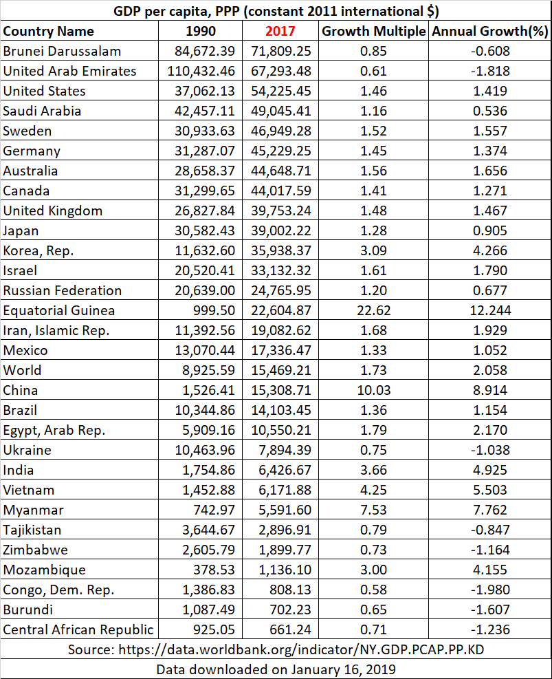
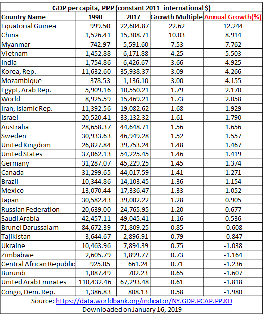

# Production and Growth {#growth}

## Introduction

The solution to a macroeconomic problem depends on whether you want a quick solution or a lasting solution.
Consider a president who is trying to ensure a bright future for the country and, thereby, his or her place in history. 
This president will want to know about __long-run economic theories__.
Now consider a president who is simply trying to get the economy going quickly so he or she will win the next election, which is six months away. 
This president will want to know about __short-run economic theories__.
In this and the next several chapters, we will look at long run macroeconomic problems and their solutions.

We saw in Section \@ref(gdp-and-wellbeing) of Chapter \@ref(natincome) that our best, though imperfect, measure of a country’s __standard of living__ is its __real GDP per person__ (also called __real GDP per capita__). In this capter, we will focus on real GDP per person and its rate of growth. Specifically, we will discus three main questions:

* In any given year, there are vast differences in real GDP per person---and in its annual rate of growth---among countries. Why?
* For any given country, real GDP per person can change dramatically over the years. Why?
* What can be done by macroeconomic policy makers to raise a country's real GDP per capita permanently?^[Unless otherwise mentioned, by gross domestic product I will mean _real_ (that is, inflation-adjused) gross domestic product, throughout the rest of this book.]

## The History of Economic Change

### The History of Economic Change: Variation in Real GDP per Person across Countries

Let's begin with a look at the data. One source of internationally comparable data is the [World Bank](https://data.worldbank.org/). In particular, let's go to the web page for a macroeconomic variable that the World Bank calls [GDP per capita, PPP (constant 2011 international \$)](https://data.worldbank.org/indicator/NY.GDP.PCAP.PP.KD). It is one measure of real GDP per capita.

Figure \@ref(fig:gdp1990) shows GDP data for a selected group of countries, in descending order of GDP in 1990. Note the huge variation. Per capita GDP was \$110,432.46 in United Arab Emirates, an oil-rich country, and \$378.53 in Mozambique. In other words, the average resident of UAE was roughly 290 times richer than the average resident of Mozambique---a mind-boggling thought.

```{r gdp1990, fig.cap='GDP per capita, and its growth, for selected countries. Source: [World Bank](https://data.worldbank.org/indicator/NY.GDP.PCAP.PP.KD)', fig.align='center', echo=FALSE}
knitr::include_graphics("figures/gdp-per-capita-table-1990.png")
```

Figure \@ref(fig:gdp2017) shows GDP data for the same group of countries, in descending order of GDP in 2017. Note the huge variation. Per capita GDP was \$71,809.25 in Brunei Darussalam, another oil-rich country, and \$661.24 in Central African Republic. In other words, the average resident of Brunei Darussalam was roughly 109 times richer than the average resident of Central African Republic. The variation is still very high, though a lot less than in 1990.

```{r gdp2017, fig.cap='GDP per capita, and its growth, for selected countries. Source: [World Bank](https://data.worldbank.org/indicator/NY.GDP.PCAP.PP.KD)', fig.align='center', echo=FALSE}

```

Living standards, as measured by real GDP per person, vary significantly among nations.  

The United Kingdom is an advanced economy. In 2011, its GDP per person was \$36,010. A negligible share of the population lives in extreme poverty, defined here as less than \$2 a day. A baby born in the United Kingdom can expect a relatively healthy childhood: Only 5 out of 1,000 children die before reaching age 5. Educational attainment is high: Among children of high school age, 98 percent are in school.

Mexico is a middle-income country. In 2011, its GDP per person was \$15,390. About 5 percent of the population lives on less than \$2 a day, and 16 out of 1,000 children die before age 5. Among those of high school age, 71 percent are in school.

Mali is a poor country. In 2011, its GDP per person was only \$1,040. Extreme poverty is the norm: More than three-quarters of the population lives on less than \$2 per day. Life is often cut short: 176 out of 1,000 children die before age 5. And educational attainment in Mali is low: Among those of high school age, only 31 percent are in school.

Video: [Basic Facts of Wealth](https://youtu.be/PzAr_mL0Qd8)


### The History of Economic Change: Real GDP per Capita can Change a Lot over Time

Within a country there are large changes in the standard of living over time. 
This gives us hope that things can get better.
It also raises the question: Why do standards of living change over time?

Figure \@ref(fig:gdpgrowth) shows GDP data for the same group of countries we were looking at above, but in descending order of the annual growth rate of real GDP per capita over 1990 -- 2017. Equatorial Guinea, a small African nation that has struck oil relatively recently, is the star performer here. It multiplied its per capita GDP by a multiple of 22.62 during 1990 -- 2017. Real GDP per capita rose dramatically from \$999.50 to \$22,604.87 in just 27 years. Equivalently, it grew at an annual rate of 12.244 percent during the period. China and Myanmar are also stellar performers.

```{r gdpgrowth, fig.cap='GDP per capita, and its growth, for selected countries. Source: [World Bank](https://data.worldbank.org/indicator/NY.GDP.PCAP.PP.KD)', fig.align='center', echo=FALSE}

```

### The History of Economic Change: Growth Rates can vary significantly across countries

But note, again, the huge variation in growth rates.  While there are the high performers such as Equatorial Guinea, China, and Myanmar, we also have countries such as the Democratic Republic of Congo. In DRC, real GDP per capita in 2017 was 0.58 of its 1990 level, falling from \$1,386.83 to \$808.13. Equivalently, the standard of living in DRC _shrank_ at the annual rate of	-1.980 percent throughout the period.

What are we to make of all this? 

1. Dramatic improvements in living standards are clearly possible. However, growth cannot be taken for granted. Big declines in living standards are also possible. In other words, growth rates vary a great deal from country to country. The question is why? Why do some countries grow fast and others grow slowly (or even _shrink_, growing at _negative_ rates)?
2. Note in Figure \@ref(fig:gdp1990) that the countries that were rich in 1990 generally did not grow very fast during the subsequent 1990 -- 2017 period, whereas several of the 1990 laggards---such as Equatorial Guinea, China, India, Vietnam, Myanmar, and Mozambique---grew quite rapidly in the subsequent period, thereby closing the gap with the front-runners. Is there some lesson in this? Are there reasons why poor countries may find it easier to grow faster and catch up with rich countries?

Video: [Growth Rates Are Crucial](https://youtu.be/VNWGEIXSuEQ)

Figure \@ref(fig:growth-experiences) shows more data on the huge variation across countries reaching back a hundred years.

```{r growth-experiences, fig.cap='Variation in Growth. Source: Principles of Economics, 8th edition, by N. Gregory Mankiw', fig.align='center', echo=FALSE}
knitr::include_graphics("figures/table-growth-experiences.png")
```

Let's look specifically at the United States. In the United States, real GDP per person was 

* \$4,044 in 1870, and
* \$47,210 in 2010, 
* implying a 1.77 percent annual growth rate, on average, over the 140-year period

Now let's look at the poorest countries. These countries have average levels of income that have not been seen in the United States for many decades.

We need to ask:

* What did the poor countries do wrong? 
* What did the USA do right?

Another point that jumps out at us in Figure \@ref(fig:gdpgrowth)  and Figure \@ref(fig:growth-experiences) is that differences in annual growth rates that seem small become large when compounded for many years.^[__Compounding__ refers to the accumulation of a growth rate over a period of time.] This gives us hope. _Even small increases in growth rates can have a significant effect in the end_.

Consider Japan and Australia in Figure \@ref(fig:gdpgrowth). Australia (\$28,658.37) was poorer than Japan (\$30,582.43) in 1990. It's growth rate (1.656 percent) was, however, slightly higher than Japan's (0.905 percent) during 1990 -- 2017. This slight, less than 1 percentage point, edge, when compounded over 27 years meant that by 2017 the tables had turned: Australia's per capita GDP (\$44,648.71) was higher than Japan's (\$39,002.22)!

Or, consider UK and USA in Figure \@ref(fig:growth-experiences). USA (\$4,264 in 2014 dollars) was poorer than UK (\$5,117) in 1870. It's growth rate (1.80 percent) was, however, slightly higher than UK's (1.42 percent) during 1870 -- 2014. This slight, less than 0.50 percentage point, edge, when compounded over 144 years meant that by 2014 the tables had turned: USA's per capita GDP (\$55,860) was higher than UK's (\$39,040)!

## Productivity

Productivity is key.
Productivity refers to the market value of the goods and services that a worker can produce from each hour of work.
Productivity plays a key role in determining living standards for all nations in the world. 
People in high-productivity countries produce:

* larger quantities, and 
* things that can be sold at higher prices.

### Determinants of Productivity

* Factors of Production
    * Physical capital per worker
    * Human capital per worker
    * Natural resources per worker
    * Technological knowledge
* Government
    * Effectiveness
    * Policies

#### Determinants of Productivity: Physical Capital

Physical Capital is the stock of equipment and structures that are used to produce goods and services. It includes:

* Tools used to build or repair things.
* Computer software
* Office buildings, factory buildings, shopping malls, schools, etc.
* Infrastructure, such as roads, railway lines, bridges, etc. 

Physical capital is a _produced_ or man-made factor of production.
Fewer consumer goods mean more physical capital.

#### Determinants of Productivity: Human Capital

Human Capital refers to the knowledge and skills that workers acquire through education, training, and experience.
Like physical capital, human capital raises a nation’s ability to produce goods and services.
Like physical capital, human capital can be acquired only by sacrificing current consumption.

#### Determinants of Productivity: Natural Resources

Natural Resources are inputs used in production that are provided by nature.
Examples: land, rivers, and mineral deposits.
Renewable resources include trees and forests.
Nonrenewable resources include petroleum and coal.

Natural Resources can be important but are not absolutely essential for an economy to be highly productive.

The search for reserves of natural resources such as petroleum and coal usually requires a sacrifice of current consumption.

Are natural resources a limit to economic growth?
Not necessarily.
Innovation has enabled us to do more and more with less and less.
Prices of most natural resources (adjusted for overall inflation) have actually been stable or _falling_.

#### Determinants of Productivity: Technological Knowledge

Technological Knowledge refers to our scientific understanding of the best ways to produce various goods and services. 
Human capital, which we saw earlier, refers to the resources expended in transmitting this understanding to workers.

Increases in technological knowledge require investment in research and development
This usually requires a sacrifice of current consumption.

Video: [The Hockey Stick of Human Prosperity](https://youtu.be/t9FSnvtcEbg).

Video: [An Orgy of Innovation](https://youtu.be/RRWKzVlbXEY).

Video: [Puzzle of Growth: Rich Countries and Poor Countries](https://youtu.be/u5P8AZRBLac).

Video: [Growth Miracles and Growth Disasters](https://youtu.be/5X5v7vRYQjc).

#### Determinants of Productivity: Government

The availability of physical capital, human capital, natural resources, and technology does not guarantee that these resources will be properly utilized. Government must 

* provide the proper incentives and 
* ensure law and order

## Goverment Policy Regarding Productivity and Its Growth

Government policies that raise productivity and living standards include policies that:

* Encourage saving and investment.
* Encourage investment from abroad
* Encourage education and training.
* Establish secure property rights and maintain political stability.
* Promote free trade.
* Promote research and development.
* Provide and maintain roads, bridges, and other infrastructure.

### Goverment Policy Regarding Productivity and Its Growth: Saving and Investment

If we use fewer resources to produce consumption goods, we will have more resources to:

* Produce physical capital
* Acquire human capital through education
* Increase our technological knowledge by doing research and development

But there is a trade-off: __more saving means less current consumption__.
It is not clear whether the government should encourage individuals to sacrifice current consumption for the sake of a brighter future.

Moreover, the accumulation of physical capital is subject to diminishing returns and the catch-up effect. 

#### Diminishing Returns and the Catch-up Effect

As the stock of capital rises, the extra output produced from an additional unit of capital falls. This property is called __diminishing returns__.
Because of diminishing returns, an increase in the rate of investment in physical capital leads to higher growth only for a while.
In the long run, a higher rate of investment in physical capital leads to a higher level of productivity and income, but not to faster growth of productivity and income.

Saving and investment must, therefore, be used intelligently, not just to accumulate more and more physical capital, but to pay for education and research on innovation.

The __catch-up effect__ implies that poorer countries would grow more rapidly than rich countries that are otherwise similar. 
From 1960 to 1990, the United States and South Korea devoted a similar share of GDP to investment. Yet the United States experience mediocre annual growth of about 2%, while South Korea experienced spectacular growth of more than 6%.

### Goverment Policy Regarding Productivity and Its Growth: Foreign Investment

Also, investment (in physical capital, human capital, and technological knowledge) can be done with foreign resources, by removing barriers to foreign investment. 
However, part of the output produced with the help of foreign investment will, naturally, go to the foreigners who made the investment.

Investment from abroad takes several forms:

* Foreign Direct Investment: Capital investment owned and operated by a foreign entity.
* Foreign Portfolio Investment: Investments financed with foreign money but operated by domestic residents.

It should be clear that foreign investors will take their earnings---interest and profits---back to their own countries.
Still, foreign investment creates jobs and raises productivity and wages in the host country.
Foreign direct investment is one way for poor countries to learn the use of state-of-the-art technologies.
For poor countries, foreign investment may be the only route to progress, especially if their incomes are barely enough to cover their essential consumption needs.

To attract foreign investment, governments must:

* protect the property rights of investors and
* provide adequate infrastructure (roads, ports, etc)

These are, by the way, necessary to attract any kind of productive investment, by domestic entrepreneurs or by foreign entrepreneurs.

### Goverment Policy Regarding Productivity and Its Growth: Education

For a country’s long-run growth, education is at least as important as investment in physical capital.
In the United States, each year of schooling raises a person’s wage, on average, by about 10 percent.
In poor countries the payoff is even higher.
Thus, one way the government can enhance the standard of living is by building schools and providing subsidies to encourage students to acquire education.

An educated person might generate new ideas that might expand society’s pool of knowledge and provide external benefits to others.
When deciding how much education to acquire, the typical individual pays attention to the prospect of earning higher wages, but ignores the external benefits of his education to the rest of society.
Therefore, it makes sense for the government to give individuals a subsidy as an extra incentive to go to school.

One problem facing some poor countries is the __brain drain__---the emigration of many of the most highly educated workers to rich countries.
If the recipient of education subsidies in a poor country emigrates to a rich country, the poor country loses its investment and the rich country gains a worker who was educated at another country’s expense

### Goverment Policy Regarding Productivity and Its Growth: Health and Nutrition

Less healthy workers are less productive.
Less healthy workers impose an external cost on the rest of society: they can infect others.
As a result, countries can get caught in a vicious cycle.
This provides a justification for government efforts to encourage saving and investment to push economic growth.

#### Robert Fogel’s Research

In Great Britain in 1780, about one in five people were so malnourished that they couldn’t do manual labor.
As nutrition improved, so did productivity.
The causation probably runs both ways: better nutrition makes us more productive and higher productivity makes better nutrition affordable.
As nations get richer, people eat more, and the population gets taller.
From 1775 to 1975, the average caloric intake in Great Britain rose by 26 percent, and the height of the average man rose by 3.6 inches.
From 1962 to 1995, the average caloric intake in South Korea rose by 44 percent, and the height of the average man rose by 2 inches.
Studies have found that height is an indicator of productivity.
Taller workers tend to earn more, especially in poor countries.

### Goverment Policy Regarding Productivity and Its Growth: Property Rights and Political Stability

Property rights refer to the ability of people to exercise authority over the resources they own.
Enforcement of property rights is an important prerequisite for the free-market system to work.
It is necessary for investors to feel that their investments are secure.
This requires a stable political and judicial system.

### Goverment Policy Regarding Productivity and Its Growth: Free Trade

Trade is, in some ways, a type of technology.
A country that eliminates trade restrictions will experience the same kind of economic growth that would occur after a major technological advance.
Suppose a country’s opportunity cost of a ton of wheat is 5 tons of rice. If this country can import a ton of wheat by exporting 3 tons of rice, it is as if the country’s technology has improved.

Trade policies can be:

* inward-orientated, avoiding interaction with other countries. 
* outward-orientated, encouraging interaction with other countries.

A country that adopts inward-oriented policies will have to make everything it needs, including the things it can’t produce efficiently.

#### Trade and Geography

A countries access to global trade depends not only on government policy but also on geography.
Countries with natural seaports find it easier to trade and prosper.
Many of the world’s major cities are located close to oceans.
Africa has suffered because many of its countries are landlocked.

Video: [Geography and Economic Growth](https://youtu.be/B8z6XS2jieE).

### Goverment Policy Regarding Productivity and Its Growth: Research and Development

The advance of technological knowledge has led to higher standards of living.
Most technological advance comes from research by private firms and individual inventors.
Government can encourage the development of new technologies through research grants, tax breaks, and the patent system.
New knowledge has external benefits.
Private researchers will consider only the gains that they can get from their innovations; they will ignore the external benefits their research creates for the rest of society.
Therefore, it makes sense for the government to subsidize or fully fund research, especially on basic or fundamental science that is valuable to society but will not be done by private businesses

### Goverment Policy Regarding Productivity and Its Growth: Population Growth

Population growth affects the per capita availability of other factors of production:

* Stretching natural resources (-ve)
* Diluting the capital stock (-ve)
* Promoting technological progress (+ve)

The overall effect of population growth on economic growth is therefore ambiguous.

It is, therefore, unclear what the government should do about population growth.

#### Population Growth: Stretching Natural Resources

Thomas Malthus (1766–1834) had argued that, because of diminishing returns in agriculture, food production could not keep pace with population growth, leading to widespread famines. 
Boy was he wrong!

Although the world’s population has increased six fold over the past two centuries, living standards are on average much higher today.
Diminishing returns lost out to human ingenuity.

#### Population Growth: Diluting the Capital Stock

If each family has a large number of children, it would be difficult to:

* Educate them all. The kids may grow up with less human capital, as a result.
* equip them all with the necessary physical capital.

#### Population Growth: Promoting Technological Progress

If there are more people:

* There are more scientists, inventors, and engineers to contribute to technological advance
* There is a larger market for innovative goods. This increases the incentive to innovate

Over the broad span of human history, the world’s rate of economic growth has increased as world population has.

As you can see, population growth can affect productivity in complicated ways. Partly for these reasons, different countries have adopted different stances on population growth. China restricts families to just one child. (Some people may consider this to be an unacceptable reduction of human freedom.) Some countries, such as Singapore, have gone the other way to _encourage_ women, through financial incentives, to have _more_ kids.

### Goverment Policy Regarding Productivity and Its Growth: It's Crucial!

What Makes a Nation Rich?
According to Daron Acemoglu, an MIT economist, the answer is Government!
Poor people are poor because they made the wrong choices.
They make wrong choices because governments gave them the wrong incentives.
If you fix government you'll fix poverty.

The Mexico-USA border fence splits Nogales into two halves that are identical in every way except government.
Median household income is \$30,000 on the USA side and \$10,000 on the Mexico side.
China has been transformed in recent decades pretty much entirely because government policies have changed.

Video: [The Importance of Institutions](https://youtu.be/wdKBfXRpNsk).
