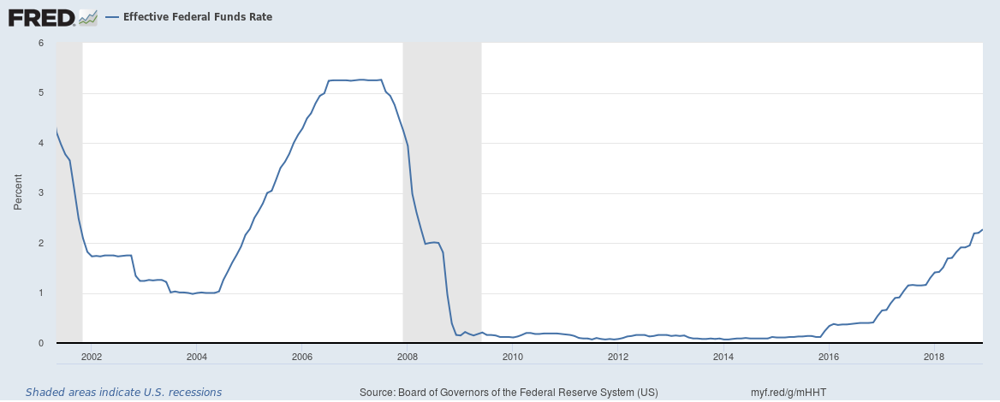

# The Monetary System {#monsys}

## THE MEANING OF MONEY

Money is the set of assets that people commonly use to buy things.

### The Meaning of Money: The Functions of Money

Money has three functions in the economy:

* _Medium of exchange_: Money is the item that buyers give to sellers when they want to purchase goods and services
* _Unit of account_: Money is the yardstick people use to post prices and record debts
* _Store of value_: Money is an item that people can use to transfer purchasing power from the present to the future

An _asset_ is anything that can be thought of as wealth.
Every asset has some amount of _liquidity_. 
Liquidity is the ease with which an asset can be converted into the economy’s medium of exchange.
As money is the economy’s medium of exchange, it is the most liquid of all assets.

### The Meaning of Money: Kinds of Money

* Commodity money: Takes the form of a commodity with intrinsic value
    * Examples:  gold coins, cigarettes in POW camps
* Fiat money: Money without intrinsic value, used as money because of government decree
    * Example:  the U.S. dollar

### The Meaning of Money: Money in the U.S. Economy

The quantity of money in an economy needs to be measured.

A basic measure, __M1__, is obtained by adding:

* Currency: the paper bills and coins in the hands of the public
* Demand deposits: balances in bank accounts that depositors can use as payment by writing a check.
* And a few other less important assets, such as travelers’ checks.

Nowadays, __M2__ is more widely used.

|Monetary Variables, February 2018 (\$ Billions)|
|:---			|---:			|
|[Currency](https://fred.stlouisfed.org/series/CURRSL) |1,540.3|
|+ [Traveler's Checks](https://fred.stlouisfed.org/series/TVCKSSL)|1.9|
|+ [Demand Deposits](https://fred.stlouisfed.org/series/DEMDEPSL) |1,474|
|+ [Other Checkable Deposits](https://fred.stlouisfed.org/series/OCDSL)|597.9|
|= [M1](https://fred.stlouisfed.org/series/M1SL)|3,614|
|+ [Savings Deposits](https://fred.stlouisfed.org/series/SAVINGSL)|9,121.9|
|+ [Small-denomination Time Deposits](https://fred.stlouisfed.org/series/STDSL)	|415.8|
|+ [Retail Money Market Mutual Funds](https://fred.stlouisfed.org/series/RMFSL)	|706.6|
|= [M2](https://fred.stlouisfed.org/series/M2SL)|13,858.3|

Video: [What Is Money?](https://youtu.be/r5eFObOFcME), Marginal Revolution University, YouTube, July 18, 2017

<!-- What are central banks?-->

## THE FEDERAL RESERVE SYSTEM

The Federal Reserve (The Fed) serves as the _central bank_ of the US.

<!--What is the banking system?-->

* It is designed to oversee the _banking system_. 
* It regulates the quantity of money in the economy. 

This activity of a central bank is called _monetary policy_.

### The Federal Reserve System: Helicopter and Vacuum Cleaner

You can think of the Fed as printing money and dropping it from helicopters, thereby adding to the quantity of money in the economy.

Conversely, you can think of the Fed as a giant vacuum cleaner that sucks money out of people’s wallets, thereby reducing the quantity of money.

The helicopter-and-vacuum view of the Fed is a bit too simple, however.
The Fed really can increase or decrease the quantity of money.
But it does so using a process called _open market operations_.

When the Fed wishes to _increase_ the quantity of money in the economy, it prints money and _buys_ financial assets---such as government bonds---on the open market.
That’s the Fed acting as a money-dropping helicopter.

Like other central banks, the Fed, as the US central bank is called, has the authority to print currency. 

But newly printed currency notes would have no effect on the economy if they simply sat in a Fed vault; the new notes would have to somehow get into people's hands and then get used in transactions like all the other currency notes printed before. 

The Fed could get its newly printed notes into people's hands by simply dropping the newly printed money all over the country from helicopters. But it doesn't do that. Instead, what the Fed has traditionally done is go to Wall Street with its newly printed dollars and buy short-term US Treasury Bonds, which are widely considered the safest of safe assets. The newly printed notes would then get into the hands of those who sold the bonds to the Fed. The new money would then begin to go from hand to hand to hand in the normal way.

When the Fed wishes to _decrease_ the quantity of money in the economy, it _sells_ financial assets---such as the government bonds it may have bought on an earlier occasion---on the open market, and burns the money it gets from the sale.
That’s the Fed acting as a money-sucking vacuum.

## BANKS AND THE MONEY SUPPLY

<!--What are banks, reserves, required reserves, excess reserves, loans, demand deposits?-->
Commercial banks can also increase or decrease the economy’s quantity of money.
That is, banks too can act like a money-dropping helicopter or a money-sucking vacuum.

Remember that the quantity of money consists of:

* Currency: the paper bills and coins in the hands of the public
* Demand deposits: balances in bank accounts that depositors can use as payment by writing a check.

Banks can control the quantity of money by controlling that second component: the quantity of demand deposits.

### Banks, in brief

Households and businesses rely on banks to keep their money safe when the money is not needed for some purchase. These households and businesses are the banks' _depositors_ and the money they keep in banks are the banks' _deposits_. 

Banks may borrow money from sources other than their depositors. This is the banks' _debt_.

So, the total amount borrowed by a bank---referred to as the bank's _liabilities_---includes both deposits and debt. 

\begin{equation}
\textrm{Liabilities} = \textrm{Deposits} + \textrm{Debt}
  (\#eq:liabilities)
\end{equation}

Finally, a bank's _capital_ -- or _owners' equity_ -- is the money the bank's owners have made available for use by the bank's managers.

Therefore, a bank's _funds_ include its deposits, its debt, and its capital.

\begin{equation}
\textrm{Funds} = \textrm{Deposits} + \textrm{Debt} + \textrm{Capital}
  (\#eq:bankFunds)
\end{equation}

A bank may use its funds to lend money to households and firms who come to it asking for money. These are the bank's _loans_.

At any given moment a bank may have some of its funds sitting in its vaults. These are the bank's _reserves_.

Finally, a bank may have used some of its funds to buy various assets (perhaps in the hope of selling those assets later at a profit). These are the bank's _securities purchases_.

The sum of a bank's loans, securities purchases, and reserves is called the bank's _assets_. 

\begin{equation}
\textrm{Assets} = \textrm{Loans} + \textrm{Securities Purchases} + \textrm{Reserves}
  (\#eq:bankAssets)
\end{equation}

A bank's assets would need to be equal to its funds. Therefore, for an individual bank or for the banking industry as a whole,

\begin{equation}
\textrm{Assets} = \textrm{Liabilities} + \textrm{Capital}
  (\#eq:bankBalance)
\end{equation}

A few more definitions ...

The _reserve ratio_ is the fraction of total deposits in banks that banks hold as reserves. Let's denote this ratio by the symbol $R$. So, $R = \textrm{reserves}/\textrm{deposits}$.

Now, a country's central bank is required to <strike>boss around</strike> _regulate_ its banks. As part of its regulatory activities, central banks typically require baks to keep a minimum level of reserves so that the bank's depositors do not have to face a situation where they turn up at a bank to withdraw cash only to be told that all of the depositors' money has been loaned out.

The fraction of its total deposits that a bank is _required_ by the central bank to keep as reserves is called the _required reserve ratio_. Let's denote it by the symbol $ReqR$. Note that $ReqR \le R$.

When banks hold reserves in excess of the required reserves, those reserves are called _excess reserves_. Let's call the fraction of its deposits that a bank holds as excess reserves its _excess reserve ratio_ and denote it $ExcR$.

Therefore,

\begin{equation}
\textrm{Reserves} = \textrm{Required Reserves} + \textrm{Excess Reserves}
  (\#eq:excessReserves)
\end{equation}

or, in brief,

\begin{equation}
R = ReqR + ExcR
  (\#eq:excessReservesShort)
\end{equation}


### Banks and the money supply

When banks make new loans _faster_ than their borrowers repay old loans, the quantity demand deposits _increases_ and, therefore, the economy’s quantity of money increases.
That is, banks can act like a money-dropping helicopter.

When banks make new loans _slower_ than their borrowers repay old loans, the quantity of demand deposits _decreases_ and, therefore, the economy’s quantity of money decreases.
That is, banks can act like a money-sucking vacuum.

### Banks and the Money Supply: Fractional-Reserve Banking

Now consider this silly example:

* The Fed prints \$10,000 and pays Alex, a caterer, who provided food at a Fed function.
* M1 increases by \$10,000. (Why?)
* Alex deposits the \$10,000 cash in Bank A.
* M1 is unchanged. (Why?)
* Bank A’s reserves increase and it decides to make a \$9,000 loan out of the new reserves to Barbara.
* Barbara, the recipient of Bank A’s loan, buys a car from Chris.
* Chris deposits \$9,000 cash in his account at Bank B.
* M1 increases by \$9,000. (Why?)

So far, the Fed’s printing of \$10,000 has already increased M1 by \$19,000.

And further increases in the money supply may follow when Bank B reacts to Chris’s deposit the way Bank A reacted to Alex’s deposit.

When a bank loans money to someone, that money generally ends up as a deposit in a second bank.
This creates more deposits and more reserves to be lent out by that second bank. 
When the second bank makes a loan from its reserves, the money supply increases again.

And the process continues …

### Banks and the Money Supply: The Money Multiplier

How much money is eventually created in this economy?
The _money multiplier_ is the name given to the amount of money the banking system generates---by way of the chain reaction or domino effect described in the previous section---with each dollar of money created by the central bank. Let's denote it by the symbol $mm$.

The money multiplier can be shown to be the reciprocal of the reserve ratio:
\begin{equation}
mm = \frac{1}{R}
  (\#eq:money-multiplier)
\end{equation}

Example: With a reserve ratio of R = 20% or 1/5, the money multiplier is 5. In this case, if the Fed prints a new dollar bill and buys a government bond with it, the money supply may increase by as much as \$5.00!

Video: [The Money Multiplier](https://youtu.be/93_Va7I7Lgg), Marginal Revolution University, YouTube, July 25, 2017

## THE FED’S TOOLS OF MONETARY CONTROL

A central bank can affect a nation's quantity of money in various ways. It:

* Influences the quantity of reserves by
    * Open-market operations
    * Fed lending to banks
* Influences the reserve ratio by
    * Reserve requirements
    * Interest on reserves

### Open-market operations

This consists of the purchase and sale of government bonds by the central bank.

To _increase_ the money supply the central bank _buys_  government bonds (with newly printed cash).

To _decrease_ the money supply the central bank _sells_  government bonds.

### Central bank's lending to banks

The _discount rate_ is the interest rate on the loans that the Fed makes to banks.
A higher discount rate reduces the money supply.
A lower discount rate increases the money supply.

The _Term Auction Facility_ is another way the Fed lends money to banks.
The Fed sets a quantity of funds it wants to lend to banks.
Eligible banks then bid to borrow those funds.
Loans go to the highest eligible bidders. To be eligible, bans must have acceptable collateral.

### Tools of Monetary Control: Reserve requirements

We saw earlier that there are central bank regulations on the minimum amount of reserves that banks must hold (reserve requirements).

An _increase_ in the reserve requirement _decreases_ the money supply. Conversely, a _decrease_ in the reserve requirement _increases_ the money supply.

However, nowadays reserve requirements are rarely used.

### Tools of Monetary Control: Paying interest on reserves

Since October 2008---during a major financial crisis in the US---the Fed began the practice of paying interest to banks on the reserves the banks held. This gave the Fed a new tool to influence the behavior of banks.

The higher the interest rate paid by the Fed on banks' reserves the more reserves the banks will choose to hold. This would increase the banks' reserve ratio ($R\uparrow$). Therefore, the money multiplier would decrease ($mm\downarrow$). Therefore, the money supply would decrease ($M\downarrow$).

Here's data on the interest rate on excess reserves paid by the Fed: [IOER](https://fred.stlouisfed.org/series/IOER).

### Tools of Monetary Control: Difficulties in Controlling the Money Supply

A central bank’s control of the money supply is not precise.
The central bank cannot avoid two problems that arise due to fractional-reserve banking.

* The central bank does not control the amount of money that households choose to hold as deposits in banks.
* The central bank does not control the amount of money that bankers choose to lend.

If people lose confidence in the banking system and decide to withdraw cash from their bank accounts and keep the cash at home, the banks would be forced to cut back on their lending. This would cause the money supply to decrease.

This is not mere theory: it actually happened during the Great Depression of the 1930s.

If banks lose confidence in the economy they may be afraid to lend, fearing that in a bad economy borrowers would default on their loans.
So, banks may decide to make fewer loans and hold more reserves.
The rise in the reserve ratio ($R\uparrow$) would reduce the money multiplier ($mm\downarrow$) and cause the money supply to decrease ($M\downarrow$).

Again, this actually happened during the Great Depression of the 1930s.

During the Great Depression both of the above factors were in play: people withdrew cash from their bank accounts and banks were afraid to lend. 
From 1929 to 1933, the US money supply fell by 28 percent, even though the Federal Reserve did not take any deliberate action to reduce the money supply.

This emphasizes the point that a central bank’s control of the money supply is imprecise.

### Fed's Tools of Monetary Control: The Federal Funds Rate

The Federal Funds Rate is the interest rate that banks charge for overnight loans to one another.
When the federal funds rate rises or falls, other interest rates often move in the same direction.
When these other interest rates change they affect the behavior of consumers and businesses. 
This, in turn, has short-run effects on the economy.

<!--The Fed Funds rate and other rates, 1970–2016-->

In recent years, the Fed has used its policy tools to control the Federal Funds Rate.
From time to time the Fed announces a target level for the federal funds rate.
The Fed then uses its monetary policy tools to push the federal funds rate to the target level.

The theory of how a central bank can control interest rates and why it does so will be discussed further when we discuss short-run monetary economics. But here's a brief overview:

To _raise_ the fed funds rate, the Fed _sells_ government bonds (open market operations). This _removes_ reserves from the banking system, _reduces_ supply of federal funds, causes the fed funds rate to _rise_. Conversely, the Fed _buys_ bonds (with newly printed money) to _reduce_ the fed funds rate.

Note that the fed funds rate and the money supply move in opposite directions.

Figure \@ref(fig:fedfunds) shows the history of the Federal Funds Rate:

```{r fedfunds, fig.cap='[The Federal Funds Rate](https://fred.stlouisfed.org/series/FEDFUNDS)', echo=FALSE}
knitr::include_graphics("figures/fedfunds.png")
```

Figure \@ref(fig:fedfunds-2) focuses on more recent experience:

```{r fedfunds-2, fig.cap='[The Federal Funds Rate](https://fred.stlouisfed.org/series/FEDFUNDS)', echo=FALSE}

```


Videos on The Federal Reserve’s Monetary Policy Tools: 

* [How the Fed Worked: Before the Great Recession](https://youtu.be/jheesQ8ot3g), Marginal Revolution University, YouTube, March 13, 2018
* [How the Fed Works: After the Great Recession](https://youtu.be/dTivWJvGYtI), Marginal Revolution University, YouTube, April 3, 2018

