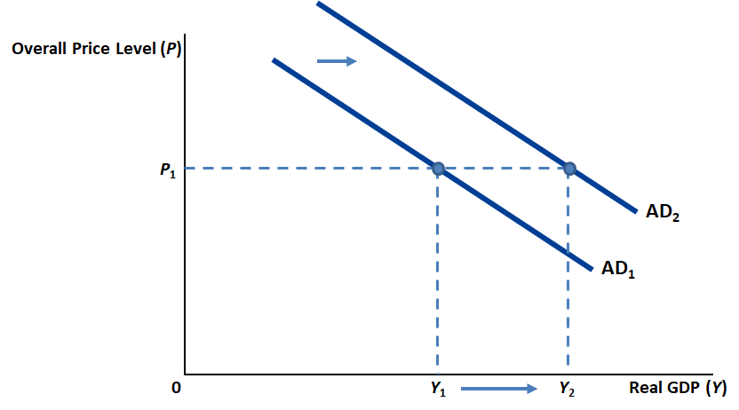

# Aggregate Demand and Aggregate Supply {#ADAS}

This chapter focuses on the causes of short-run fluctuations in economic activity. The bulk of the chapter discusses an important theory called the theory of Aggregate Demand and Aggregate Supply (AD-AS theory). The chapter also discusses what the AD-AS theory has to say about how government policies can counteract -- or dampen, or reduce -- short-run fluctuations in macroeconomic activity.

But we begin with a look at data on [real GDP](https://udayanroy62.github.io/intromacro/natincome.html#gross-domestic-product-real) in the United States.

## Short-Run Fluctuations in Real Gross Domestic Product {#ADAS_data}

The first thing to notice is that _real GDP does fluctuate in the short run_.

* Real GDP is not constant: it changes from year to year and even from quarter to quarter.
* Specifically, real GDP increases in most years.
  * On average over the past 50 years, real GDP in the U.S. has grown by about 3 percent per year. 
  * Real GDP per person has grown at the rate of about 2 percent per year over the past century.
* In some years, however, real GDP decreases, marking a recession.  

Here are some terms that you need to be familiar with, as they are often used in news reports:

* A _recession_ is a period of declining real GDP, and rising unemployment. Recessions are also called _contractions_.
* A _depression_ is a severe recession.
* A _recovery_ is a period of increasing real GDP, and falling unemployment. Recoveries are also called _expansions_.
* A _boom_ is a strong recovery.
* A _business cycle_ is a period of time that includes a recession and a recovery.
* The _peak_ of a business cycle is the date at which the recession/contraction of the business cycle begins.
* The _trough_ of a business cycle is the date at which the recovery/expansion of the business cycle begins.
* The _length_ of a business cycle is the time between one peak and the next or the time between one trough and the next.

The peaks and troughs of the US business cycle are officially registered by the [NBER](https://www.nber.org/research/data/us-business-cycle-expansions-and-contractions).
During 1945-2009, there have been 11 business cycles in the US. The average recession lasted 11 months and the average recovery lasted 59 months, thereby making the average business cycle roughly 70 months long.

But these averages mean very little in this case because _short-run macroeconomic fluctuations are irregular and unpredictable_. 

* In the US, there were recessions in 1980 and 1982, just two years apart.
* On the other hand, there were no recessions between 1991 and 2001 and none between 2009 and 2020.

_Most macroeconomic variables fluctuate together_. When real GDP falls in a recession, so do many other variables:
personal income, corporate profits, consumption spending, investment spending, industrial production, retail sales, home sales, auto sales, etc.
However, not all these variables fluctuate to the same extent: investment spending fluctuates a lot more than the other variables. 
Even though investment is only about one-seventh of GDP in the US, much of the fall in GDP during recessions is due to declines in investment spending.^[An exception to this is the Covid-19 recession of 2020, which was driven primarily by a sharp decline in consumption spending. People cut back on spending that could expose them to the virus.]

_When output falls, unemployment rises_. The unemployment rate never approaches zero. Instead it fluctuates around its long-run rate, which itself fluctuates between 5 and 6 percent.

<!--See Figure 1 (a), next slide-->
<!-- Figure 1 A Look at Short-Run Economic Fluctuations (a)-->
<!-- See Figure 1 (b), next slide-->
<!--See Figure 1 (c), next slide-->

## Long-Run Macroeconomics and Short-Run Macroeconomics {#ADAS_longshort}

In Chapter \@ref(growth), we saw that in the long run a country's real GDP depends on:

* number of workers
* physical capital per worker
* human capital per worker
* natural resources per worker
* technological knowledge
* laws, government policies, and their enforcement

In Chapter \@ref(finsys), we saw that saving, investment, and the real interest rate depend on:

* the supply of loanable funds, and 
* the demand for loanable funds.

In Chapter \@ref(unemployment), we saw that in the long run a country's unemployment rate depends on:

* how well the labor market matches unemployed workers to job vacancies, and
* how close the prevailing wage is to the equilibrium wage.

Note that these chapters discussed the long-run macroeconomic behavior of the real macroeconomic variables such as output, saving, investment, the real interest rate, and unemployment without once mentioning the quantity of money circulating in an economy or the role of a country's central bank in determining the quantity of money. Money and central banks make a belated appearance only in Chapter \@ref(monsys).

Chapter \@ref(inflation) reinforced the idea that in the long-run _money is neutral_ -- neither the quantity of money nor its growth rate has any effect on the key _real_ macroeconomic variables. We saw, however, that in the long run the quantity of money does affect _nominal_ macroeconomic variables such as the price level, the rate of inflation, and the nominal interest rate: 

* the price level rises when the quantity of money rises, 
* the rate of inflation increases when the growth rate of the quantity of money increases, and
* the factors that affect the real interest rate (Ch. \@ref(finsys)) and the inflation rate (Ch. \@ref(inflation)) together determine the nominal interest rate.

Most economists believe that the long run theory we just reviewed does not explain short run fluctuations. In particular, monetary neutrality, which we studied in Chapter \@ref(inflation), is considered true in the long run but not true in the short run. Indeed, the statistical evidence is clear that the monetary policy implemented by a country's central bank has no effect on real variables (especially real GDP and unemployment) in the long run, but has significant effects on real variables in the short run.

For these reasons, we need a separate theory of short-run macroeconomics. And that theory will need to explain why, in the short run, the quantity of money _can_ affect output, unemployment, and other _real_ macroeconomic variables.

Video: [Intro to Business Fluctuations](https://youtu.be/vnUo82ZCo5s), Marginal Revolution University, YouTube, April 11, 2017.

## The Theory of Aggregate Demand and Aggregate Supply {#ADAS_theory}

Economists use the theory of aggregate demand and aggregate supply to explain short-run fluctuations in economic activity (around the economy's long-run trend).
Aggregate demand and aggregate supply are two ways in which _real GDP_ and the _overall price level_ are linked to each other in the short run. 

Recall that one way of looking at real GDP is that it is the total inflation-adjusted expenditure on domestically produced final goods and services. The _aggregate demand curve_ shows the total inflation-adjusted expenditure on domestically produced final goods and services that is _collectively desired_ by all buyers -- households, firms, the government, and foreigners -- at each price level. In other words, the desires of buyers gives us a link between the overall price level and real GDP. This link is the AD curve, as shown in Figure \@ref(fig:AD1.png).

```{r AD-curve, fig.cap='The _aggregate demand curve_ shows the total quantity of “Made in USA” goods and services that everybody -- households, firms, the government, and foreigners -- wants to buy at each price level.', out.width='100%', fig.asp=.75, fig.align='center', echo=FALSE}
knitr::include_graphics("figures/AD1.png")
```

Recall that another way of looking at real GDP is that it is the inflation-adjusted value of all final goods and services produced domestically. The _aggregate supply curve_ shows the inflation-adjusted value of all final goods and services that domestic producers _collectively desire_ to produce at each price level. In other words, the desires of producers gives us a link between the overall price level and real GDP. This link is the AS curve, as shown in Figure \@ref(fig:AS1.png).

```{r AS-curve, fig.cap='The _aggregate supply curve_ shows the total quantity of “Made in USA” goods and services that US firms would like to produce and sell at each price level.', out.width='100%', fig.asp=.75, fig.align='center', echo=FALSE}

```

The two curves, AD and AS, together give us the _aggregate demand and aggregate supply diagram_ (or the _AD-AS diagram_, for short). The intersection of the aggregate demand curve and the aggregate supply curve in the AD-AS diagram pinpoints the _short-run macroeconomic equilibrium outcome_ of the AD-AS theory.

```{r AD-AS-equilibrium, fig.cap='The intersection of the aggregate demand curve and the aggregate supply curve pinpoints the _short-run macroeconomic equilibroum outcome_ of the AD-AS theory.', out.width='100%', fig.asp=.75, fig.align='center', echo=FALSE}
knitr::include_graphics("figures/AD-AS-1.png")
```

An understanding of how the AD and AS curves move right or move left can help us use the AD-AS diagram to deduce how various changes in government policy -- a change in tax rates, for example -- and various changes beyond the government's control -- say, a pandemic -- can in turn change real GDP and the overall price level. For example, if a __tax cut__ is expected to move the AD curve to the right and have no effect on the AS curve, then the AD-AS diagram of the AD-AS theory would say that both real GDP and the overall price level would increase. 

```{r AD-AS-tax-cut, fig.cap='Here you see a hint at how the AD-AS diagram could be used to make testable predictions. If a __tax cut__ moves the AD curve to the right and has no effect on the AS curve, then the AD-AS diagram of the AD-AS theory would say that both real GDP and the overall price level will increase.', out.width='100%', fig.asp=.75, fig.align='center', echo=FALSE}
knitr::include_graphics("figures/AD-AS-tax-cut.png")
```

Figure \@ref(fig:AD-AS-tax-cut) makes a _testable prediction_. Data on tax rates, real GDP, and the overall price level are often readily available. So, under ideal circumstances, we might be able to check whether the AD-AS theory's prediction -- that real GDP and the overall price level will change in the opposite direction whenever the tax rate changes -- is accurate or not. If the prediction is proven false, we'll have to start over and try a different theory. That's the way we progress.

The point is that a theory needs to make testable predictions. If those predictions turn out okay, the theory would be useful to policy makers.

With our first look at the AD-AS theory now over, we need to drill deeper.

### The Aggregate Demand Curve: Why the Aggregate-Demand Curve Slopes Downward {#ADAS_theory_ADslope}

The aggregate demand for goods and services has four components:
\begin{equation}
\textrm{Aggregate Demand} = C + I + G + NX.
  (\#eq:aggregate-demand)
\end{equation}

Here we interpret $C$, $I$, $G$, and $NX$ as the _desired_ levels of consumption, investment, government purchases, and net exports.^[Recall that we first saw these symbols in Section \@ref(gdp-components). But in that case $C$, $I$, $G$, and $NX$ represented the actual data on consumption, investment, government purchases, and net exports.]

#### Why the demand curve for ice cream can’t explain the AD curve {#ADAS_theory_ADslope_micromacro}

We need to understand the nature of the effect of the overall price level on the total expenditure on domestically-produced final goods and services, which is simply real GDP from the point of view of the various buyers of domestically-produced final goods and services. Will a decrease in the overall price level lead to an increase in real GDP?

From the study of microeconomics, we know that the demand curve for an individual commodity -- such as ice cream -- is downward sloping. That is, a decrease in the price of ice cream leads to an increase in the consumption of ice cream (assuming all other factors that affect the consumption of ice cream are unchanged). This is because of two effects:

* Substitution effect: when ice cream becomes cheaper people buy more ice cream because it now makes sense to switch from frozen yogurt (a substitute) to ice cream
* Income effect: when price of ice cream falls and income is unchanged, people _feel_ richer and, fort that reason, buy more ice cream

But this microeconomic explanation of the demand for one particular product does not help us understand how a decrease in the overall price level affects overall spending. The AD curve can consider only changes in the _overall_ price level. If _all_ prices decrease, there can be no substitution effect.

Moreover, the microeconomic discussion of the demand for ice cream talks about the effects of a change in the price of ice cream when consumer income -- and all other factors that consumers consider relevant -- are unchanged. It is inconsistent to talk about changes in aggregate demand while assuming unchanged income, because aggregate income must be equal to aggregate demand. Therefore, the income effect of the microeconomic theory of demand can’t be applied to the aggregate economy.

The _macroeconomic_ theory of aggregate demand argues that _the Aggregate-Demand Curve slopes downward_ because of three effects:

* The Wealth Effect: a lower price level boosts consumption spending by households ($C$)
* The Interest-Rate Effect: a lower price level boosts investment spending by businesses ($I$)
* The Exchange-Rate Effect: a lower price level boosts net exports ($NX$)

As a result, a lower price level boosts aggregate demand ($C + I + G + NX$).

#### The Aggregate-demand curve: Why the Aggregate-Demand Curve Slopes Downward: The Price Level and Consumption: The Wealth Effect {#ADAS_theory_ADslope_wealth}

To keep things simple, assume all prices fall by, say, ten percent. This implies a decrease in the overall price level ($P\downarrow$). As a result, the purchasing power of consumers’ monetary wealth increases.^[The purchasing power of non-monetary wealth -- such as property, artwork, gold, etc. -- is unaffected.]

This causes consumption spending to rise ($C\uparrow$).^[Besides, if the price decline is perceived to be temporary it makes sense to buy what you need now, while prices are still low.]

Investment spending is done by businesses and government spending is done by governments. So, $I$ and $G$ are unaffected by the wealth effect. 

Part of the rise in consumption spending may include a rise in spending on imported consumer goods. This would reduce net exports (NX\downarrow$). But for every $1.00 in additional consumer spending as a result of the wealth effect, additinal spending on imported  consumer goods would be smaller -- say, $0.25. Therefore, while $C$ would increase by $1.00, $NX# would decrease by $0.25. Therefore, $C+NX$ would increase -- by $0.75.

Therefore, we conclude that a decrease in the overall price level ($P\downarrow$) leads to an increase in aggregate demand ($C + I + G + NX\uparrow$). 

This is the first reason why the AD curve is downward sloping.

##### Wealth Effect Controversy: Could the aggregate demand curve be _upward_ sloping? {-}

Let's briefly consider a strange possibility. A decrease in the overall price level ($P\downarrow$) increases the real -- that is, inflation-adjusted -- value of all monetary debts. This makes debtors poorer and creditors richer, by the same amount. This causes consumption spending to fall for debtors and rise for creditors. If debtors are poor and creditors rich, it might well be that the consumption of the debtors will fall by more than the consumption of the creditors will rise. 
Therefore, it is possible that overall consumption spending may fall ($C\downarrow$). Therefore, a fall in the overall price level ($P\downarrow$) could cause aggregate demand  to _fall_ ($C+I+G+NX\downarrow$)!! For this reason, the economist Paul Krugman has argued that _the AD curve may in some cases be upward rising_!


#### The Aggregate Demand curve: Why the Aggregate Demand Curve Slopes Downward: The Price Level and Investment: The Interest-Rate Effect {#ADAS_theory_ADslope_interestrate}

Again, to keep things simple, assume all prices fall by, say, ten percent. When all prices _fall_, people need _less_ cash for day-to-day shopping needs. They lend the unneeded cash to earn some interest income. The increased availability of loans _reduces_ the interest rate.^[See Chapter \@ref(ADpolicy) for more on this.]

A lower interest rate encourages _greater_ investment spending by businesses ($I\uparrow$).

For simplicity, let us assume that a decrease in interest rates does not reduce $C$, $G$, and $NX$. Then, we conclude that a decrease in the overall price level ($P\downarrow$) leads to an increase in aggregate demand ($C + I + G + NX\uparrow$).

This is the second reason why the AD curve is downward sloping.

#### The Aggregate Demand curve: Why the Aggregate Demand Curve Slopes Downward: The Price Level and Net Exports: The Exchange-Rate Effect {#ADAS_theory_ADslope_exchangerate}

We saw in the previous section that lower prices lead to lower interest rates. 

How will lower interest rates affect the buying and selling of the domestic currency in foreign exchange markets? Taking the US as an example, we can say that disappointed foreigners -- and even some US residents -- will want to move the money they had been holding in US banks to foreign banks. To do so they'd need to sell their US dollars and buy the foreign currencies that banks in other countries will take. 

As a result of this rush to sell dollars and buy foreign currencies, the value of the dollar will fall. For example, the value of $1.00 may decrease from €2.00 to €1.00.

As a result, US goods will become cheaper relative to foreign goods. This will make U.S. net exports increase ($NX\uparrow$).

Assuming $C$, $I$ and $G$ do not decrease as a result of the fall in the value of the US dollar, $NX\uparrow$ implies an increase in aggregate demand ($C+I+G+NX\uparrow$).

So, we can conclude that a decrease in the overall price level ($P\downarrow$) will lead to an increase in aggregate demand ($C + I + G + NX\uparrow$).

This is the third reason why the AD curve is downward sloping.

### The Aggregate Demand Curve: Why It Might Shift {#ADAS_theory_ADshift}

```{r AD-shift, fig.cap='An increase in aggregate demand', out.width='100%', fig.asp=.75, fig.align='center', echo=FALSE}

```

Refering to Figure \@ref(fig:AD-shift), assume the aggregate demand curve was $AD_1$ last week but $AD_2$ this week. In particular, assume that all prices were the same last week and this week, but aggregate spending on domestically produced final goods and services, which is also real GDP from the point of view of the buyers of domestically produced final goods and services, was $Y_1$ last week but $Y_2$ this week. How could this have happened? How could aggregate demand, $C+I+G+NX$, have increased from $Y_1$ to $Y_2$ even though all prices were unchanged?

Recall from the previous section -- i.e., Section \@ref(ADAS_theory_ADslope) -- that the AD curve slopes downward and that aggregate demand increases when the overall price level decreases. The previous paragraph brings up a new question: How could aggregate demand increase even even when all prices stay the same?

Actually, there are many possibilities. A rightward shift of the aggregate demand curve could arise via:

* Consumption: an increase in consumer optimism, a cut in tax rates, an increase in prices of assets (stocks, bonds, real estate, etc.)
* Investment: technological progress, an increase business confidence, a cut in tax rates on business profits, an increase in money supply engineered by the central bank
* Government Purchases: a fiscal stimulus
* Net Exports: an increase in foreign GDP, an increase in the expected future value of the domestic currency, an increase in money supply engineered by the central bank

That these changes would increase aggregate demand from $Y_1$ last week to $Y_2$ this week in Figure \@ref(fig:AD-shift) even if the overall price level stays unchanged at $P_1$ is pretty much self explanatory. These _shift factors_ are often put into three groups: expansionary fiscal policy, expansionary monetary policy, and favorable AD shocks.

#### Expansionary fiscal policy {#ADAS_theory_ADshift_fiscal}

* Consumption: a cut in tax rates (which leads to higher consumption spending: $C\uparrow$)
* Government Purchases: a fiscal stimulus (increase in government purchases: $G\uparrow$)

Either way, aggregate demand increases ($C + I + G + NX\uparrow$) from $Y_1$ last week to $Y_2$ this week in Figure \@ref(fig:AD-shift) even though the overall price level is unchanged at $P_1$.

#### Expansionary monetary policy {#ADAS_theory_ADshift_monetary}

* Investment: an increase in money supply engineered by the central bank. (This reduces the interest rate, which leads to higher investment spending: $I\uparrow$). 

So, aggregate demand increases ($C + I + G + NX\uparrow$) from $Y_1$ last week to $Y_2$ this week in Figure \@ref(fig:AD-shift) even though the overall price level is unchanged at $P_1$.

Video: [The Aggregate Demand Curve](https://youtu.be/jL94Fdcdv1Y), Marginal Revolution University, YouTube, April 18, 2017. In this video, the growth rate of real GDP is measured on the horizontal axis and the growth rate of the price level (that is, inflation) is measured on the vertical axis.

#### Favorable $AD$ Shocks {#ADAS_theory_ADshift_shocks}

* Consumption: an increase in consumer optimism, an increase in prices of assets (stocks, bonds, real estate, etc.)
* Investment: technological progress, an increase business confidence
* Net Exports: an increase in foreign GDP, an increase in the expected future value of the domestic currency

So, once again, aggregate demand increases ($C + I + G + NX\uparrow$) from $Y_1$ last week to $Y_2$ this week in Figure \@ref(fig:AD-shift) even though the overall price level is unchanged at $P_1$.

### The Aggregate Supply Curve {#ADAS_theory_AS}

Recall that the _aggregate supply curve_ shows the inflation-adjusted value of all final goods and services that domestic producers _collectively desire to produce_ at each price level. In other words, the desires of producers gives us a link between the overall price level and real GDP, as in Figure \@ref(fig:AS1).

But there are actually _two_ aggregate supply curves. The upward-sloping aggregate supply curve that we saw before in Figure \@ref(fig:AS1) is the _short-run aggregate-supply (SRAS) curve_.

There's also a _long-run aggregate-supply (LRAS) curve_. It is vertical.

```{r LRAS, fig.cap='The Aggregate Supply Curve for the Long Run', out.width='100%', fig.asp=.75, fig.align='center', echo=FALSE}
knitr::include_graphics("figures/LRAS1.png")
```

#### The Long-Run Aggregate Supply Curve {#ADAS_theory_AS_LRASslope}

An economy’s [long-run real output](https://udayanroy62.github.io/intromacro/growth.html#growth) of goods and services is also called the _natural rate of output_ or _potential output_ or _full-employment output_.

A country's natural rate of output depends on the:

* availability of labor
* availability of physical capital
* availability of human capital
* availability of natural resources
* Technology
* Laws, government policies, and their enforcement

In the long run, these variables are not affected by changes in the overall price level. This makes the LRAS curve a vertical line at precisely the country's long-run real GDP.

To simplify our discussion, imagine that the prices of all commodities -- every single output and every single input -- increase by ten percent. This will not alter any trade-off faced by any person. Therefore, there is no reason to expect any of the decisions people make to change. The economy will continue unaffected. This is why it make sense that the LRAS curve is vertical.

#### Why the Long-Run Aggregate-Supply Curve Might Shift {#ADAS_theory_AS_LRASshifts}

```{r LRAS_shift, fig.cap='The Long Run Aggregate Supply Curve shifts right if and only if there is an increase in the economy\'s productive capacity, which is represented by the economy\'s _natural rate of output_ or _potential output_ or _full-employment output_ or _long-run real GDP_.', out.width='100%', fig.asp=.75, fig.align='center', echo=FALSE}
knitr::include_graphics("figures/LRAS-shift.png")
```

Any change in the economy that alters the natural rate of output also shifts the long-run aggregate-supply curve. So, the LRAS curve will shift because of changes in the very same factors that affect the natural rate of output:

* availability of labor
* availability of physical capital
* availability of human capital
* availability of natural resources
* Technology
* Laws, government policies, and their enforcement

Video: [The Long-Run Aggregate Supply Curve](https://youtu.be/xqPpjR5X0ZY), Marginal Revolution University, YouTube, April 25, 2017. This LRAS has the growth rate of real GDP on the horizontal axis and the growth rate of the price level (inflation) on the vertical axis.

#### The Aggregate-Supply Curve Slopes Upward in the Short Run {#ADAS_theory_AS_SRASslope}

Recall one more time that the aggregate supply curve shows the inflation-adjusted value of all final goods and services that domestic producers collectively desire to produce at each price level. In the short run, an increase in the overall level of prices tends to increase aggregate supply. Conversely, a decrease in the overall level of prices tends to decrease aggregate supply. That is, _the SRAS curve is upward sloping_, as in Figure \@ref(fig:SRAS1). 

```{r SRAS1, fig.cap='The Short Run Aggregate Supply Curve', out.width='100%', fig.asp=.75, fig.align='center', echo=FALSE}

```

But why? Economists have offered three reasons why the Aggregate Supply Curve slopes upward in the short run:

* The Sticky Wage Theory
* The Sticky Price Theory
* The Misperceptions Theory

Although these are three different arguments, they are all expressed with the same equation:
\begin{equation}
Y = Y_N+a\times(P-P^e)
  (\#eq:SRASeqn)
\end{equation}
for $a>0$.

That real GDP ($Y$) and the overall price level ($P$) are in equation \@ref(eq:SRASeqn) is no surprise; after all, the SRAS curve is meant to show the effect of $P$ on $Y$. But long-run real GDP ($Y_N$) and the current expectation of future prices ($P^e$) also important.

As $a>0$ is assumed, if the overall price level ($P$) increases so does short-run real GDP ($Y$), as long as $P^e$ and $Y_N$ are unchanged. In graphical terms, _the SRAS curve is upward sloping_, as in Figure \@ref(fig:SRAS1), for specified values of $P^e$ and $Y_N$.

Note that if $P = P^e$, then $Y = Y_N$. 

##### Why the Aggregate-Supply Curve Slopes Upward in the Short Run: The Sticky-Wage Theory {#ADAS_theory_AS_SRASslope_stickywage}

Suppose wages for 2019 were agreed upon in 2018.
These 2018 wage agreements were based on the output prices that were expected to prevail in 2019.
Suppose, in 2019, actual prices turn out less than what had been expected (back in 2018).
Wages cannot adjust immediately to the unexpectedly low price level (because they were settled in 2018).
An unexpectedly low price level and an unchanged wage level makes employment and production less profitable.
This induces firms to reduce the quantity of goods and services supplied; workers lose jobs.

In other words, the short-run AS curve is upward rising.

Video: [Sticky Wages](https://youtu.be/IbiPQI0wMAk), Marginal Revolution University, YouTube, May 2, 2017

##### Why the Aggregate-Supply Curve Slopes Upward in the Short Run: The Sticky-Price Theory {#ADAS_theory_AS_SRASslope_stickyprice}

As a result of menu costs (see Ch. 12), some firms may be unable to change their prices in response to changing economic conditions.
An unexpected fall in the overall price level leaves such firms with high prices relative to other firms that can quickly adjust their prices.
This depresses their sales, which induces these firms to reduce the quantity of goods and services they produce. 
Workers lose jobs.

##### Why the Aggregate-Supply Curve Slopes Upward in the Short Run: The Misperceptions Theory {#ADAS_theory_AS_SRASslope_misperceptions}

Suppose an overall decline in demand reduces all prices
A wheat farmer sees only that wheat prices have fallen and continues to believe that the prices of the things that she buys (milk, shoes, clothes, etc.) are unchanged at the level she had expected
This makes work less attractive and so the farmer reduces her production of wheat. 
I am assuming  that the wheat farmer knows only how to produce wheat
When this is repeated across the economy, both the overall price level and total output fall.

So, production decreases below the full-employment level when $P$ falls below $P^e$.
In other words, the AS curve is upward rising.

Video: [The Short-Run Aggregate Supply Curve](https://youtu.be/8oQxzHgceBA), Marginal Revolution University, YouTube, May 9, 2017. In this treatment, the SRAS has the growth rate of real GDP on the horizontal axis and the growth rate of the price level (inflation) on the vertical axis.

#### Why the Short-Run Aggregate-Supply Curve Might Shift {#ADAS_theory_AS_SRASshift}

The SRAS curve shifts right if:

* The expected price falls, or
* The natural rate of output increases

## Two causes of economic fluctuations {#ADAS_fluctuations}

Focus on (a) long-run equilibrium, (b) short-run equilibrium following a disturbance that throws the economy off the long-run equilibrium, and (c) the readjustment to a new long-run equilibrium after the disturbance

<!--Figure 7 The Long-Run Equilibrium
Figure 8 A Contraction in Aggregate Demand-->

### Two causes of economic fluctuations: The Effects of a Shift in Aggregate Demand {#ADAS_fluctuations_AD}

When there is a contraction (leftward shift) in Aggregate Demand, these are the short run effects:

* output decreases, 
* the overall price level decreases, and 
* the unemployment rate increases

And these are the long run effects:

* the overall price level decreases, but 
* output and the unemployment rate  remain unchanged at their long-run levels. 

So, the economy heals itself in the long run. But it is unclear how long this self-healing might take.

If production and employment take too long to return to their long-run levels, the government could step in to hasten the process of healing.
The government could push the aggregate demand curve back where it was. It could do so by:

* increasing the money supply (expansionary monetary policy)
* cutting taxes or increasing government spending (expansionary fiscal policy)

<!--Figure 9 U.S. real GDP growth since 1900-->

#### History of Economic Fluctuations Caused by Changes in Aggregate Demand {#ADAS_fluctuations_AD_history}

In history, there have been two big shifts in aggregate demand: 

* Great Depression 
* World War II

The _Great Depression_ of the early 1930s was by far the worst economic downturn in US history.

From 1929 to 1933:

* Real GDP fell by 27%
* Unemployment rose from 3 to 25%
* Price level fell by 22%

Most historians blame a decrease in aggregate demand. Specifically, most historians blame  the 28% fall in the money supply.
People lost faith in the banking system and began to withdraw their money. Banks did not have the money to lend to businesses. Starved of loans, businesses shut down. Other businesses had to abandon expansion plans.
The Fed could have printed money and loaned it to the banks, but that did not happen.

Another suggested cause of the fall in aggregate demand during the Great Depression was the
Stock market crash. It led to a decrease in household wealth which led to a decrease in consumption spending which led to a decrease in aggregate demand.

In the case of _World War II_, the early 1940s saw a large increase in real GDP.

More resources were made available to the military.
Government purchases increased fivefold 1939 - 1944.
Aggregate demand – increased 1939 - 1944. This led to:

* Doubling of the economy’s production of goods and services.
* 20% increase in the price level
* Unemployment fell from 17% to 1%, lowest in US history

In the case of the Great Recession of 2008-09, the crisis of 2008 may have been caused by the Fed’s overreaction to the recession of 2001.
The Fed cut interest rates sharply at that time and kept them low for too long.
Those low interest rates may have fueled a ‘bubble’ in home prices.

Ther were significant developments in the mortgage market.
It became easier for subprime borrowers to get loans.
Borrowers with a higher risk of default (as indicated by income and credit history) received generous loans.
Securitization became prominent. It is a process by which a financial institution (mortgage originator) makes loan, and then another (investment bank) bundles them together into mortgage-backed securities.

The mortgage-backed securities were sold to other institutions, which may not have fully appreciated the risks in these securities.

Inadequate regulation of these high-risk loans, and misguided government policy
encouraged this high-risk lending.

During 1995-2006:

* Increase in housing demand
* Increase in housing prices, which more than doubled

During 2006-2009:

* housing prices fell 30%
* Substantial rise in mortgage defaults and home foreclosures
* Financial institutions that owned mortgage-backed securities suffered huge losses and stopped making loans

All this led to a large contractionary shift in the AD curve.

* Real GDP fell sharply: By 4.2% between the forth quarter of 2007 and the second quarter of 2009
* Employment fell sharply: Unemployment rate rose from 4.4% in May 2007 to 10.0% in October 2009 

Three policy actions were taken - aimed in part at returning AD to its previous level:

The Fed reacted as follows:

* Cut its target for the federal funds rate from 5.25% in September 2007 to about zero in December 2008
* Started buying mortgage-backed securities and other private loans in open-market operations
* Provided banks with additional funds
  
The U.S. Treasury reacted as follows:

In October 2008, Wall Street bailout \$700 billion was put in place. This was for the Treasury to use:

* to rescue the financial system
* To stem the financial crisis on Wall Street
* To make loans easier to obtain

The equity injections into banks meant that the U.S. government temporarily became a part owner of these banks.
  
In January 2009, President Barack Obama assumed office. He signed the \$787 billion stimulus bill, on February 17, 2009, to be spent over two years.

Recovery officially began June 2009.
But it was slow: average annual growth was 2.1% during 2009Q2 – 2015Q4.
Unemployment  fell to 5.0% by end of 2015, but employment-population ratio was unchanged.

Video: [The Great Recession](https://youtu.be/dI6HNi5I8d4), Marginal Revolution University, YouTube, August 9, 2016

### Two causes of economic fluctuations: The Effects of a Shift in Aggregate Supply {#ADAS_fluctuations_AS}

A leftward shift in Short-Run Aggregate Supply has the following effects:

* Output falls below the natural rate of output
* Unemployment rises
* The price level rises

If the government does nothing, the SRAS gradually shifts back to where it was. 
The price level, total production and unemployment is unaffected in the long run. 
<!--Figure 10 An Adverse Shift in Aggregate Supply-->

Leftward shifts in aggregate supply cause stagflation---a period of recession and inflation.
Output falls and prices rise.
Policymakers can influence aggregate demand. But they cannot offset both of these adverse effects simultaneously.

Policymakers may respond to a recession in one of the following ways:

* Do nothing and wait for prices and wages to adjust.
* Take action to increase aggregate demand by using (expansionary) monetary and fiscal policy.

<!--Figure 11 Accommodating an Adverse Shift in Aggregate Supply-->


## John Maynard Keynes (1883-1946) {-}

Our understanding of the short-run behavior of the economy grew out of economists’ attempts to understand why the Great Depression happened.
Published in 1936, Keynes’s _The General Theory of Employment, Interest and Money_ laid the foundations.

>“The long run is a misleading guide to current affairs. In the long run we are all dead. Economists set themselves too easy, too useless a task if in tempestuous seasons they can only tell us when the storm is long past, the ocean will be flat.”

>From "A Tract on Monetary Reform" by John Maynard Keynes (1923) 

Video: [Game of Theories: The Keynesians](https://youtu.be/cYNVB5iqydk), Marginal Revolution University, YouTube, November 7, 2017

Video: [Game of Theories: The Great Recession](https://youtu.be/_lsbJRmNcic), Marginal Revolution University, YouTube, December 5, 2017
